# OHC Trend Forecast Pipeline — Overview

A five-step Databricks pipeline that extracts healthcare claims from Snowflake,
densifies them into complete longitudinal series, engineers time-series features,
trains LightGBM models, and publishes a 21-month forward forecast for reporting.

**Business purpose:** project allowed cost (PMPM) and utilization (per 1,000
members per year) 21 months forward, broken out by market, product, and service
category, with SHAP attributions explaining each forecast.

---

## Contents

1. [End-to-end flow](#1-end-to-end-flow)
2. [Data lineage](#2-data-lineage)
3. [Grain evolution](#3-grain-evolution)
4. [Step 1 — Extract HCTA](#4-step-1--extract-hcta)
5. [Step 2 — OHC Completed Combined](#5-step-2--ohc-completed-combined)
6. [Step 3 — Signals Units](#6-step-3--signals-units)
7. [Step 4 — LightGBM Train](#7-step-4--lightgbm-train)
8. [Step 5 — Final Output](#8-step-5--final-output)
9. [External input: seasonality factors](#9-external-input-seasonality-factors)
10. [Orchestration and parameter flow](#10-orchestration-and-parameter-flow)
11. [Glossary](#11-glossary)
12. [Data dictionary](#12-data-dictionary)
13. [Runbook](#13-runbook)
14. [Known issues at a glance](#14-known-issues-at-a-glance)

---

## 1. End-to-end flow

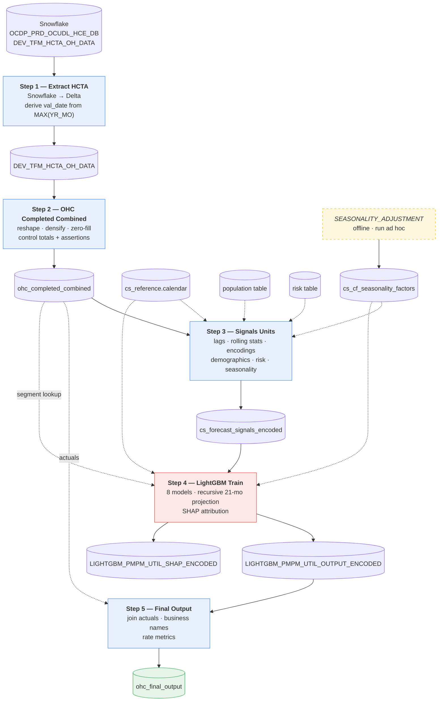

Solid arrows are the primary path. Dotted arrows are reference joins. The dashed
box is an offline process not wired into the workflow.

---

## 2. Data lineage

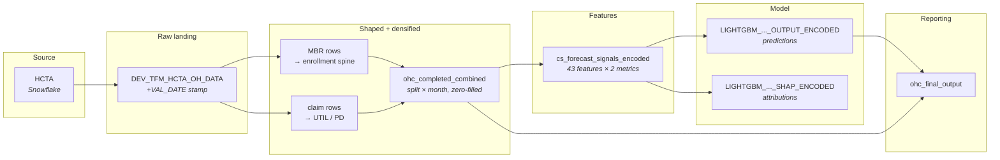

### Table reference

| Table | Written by | Read by | Keyed on |
|---|---|---|---|
| `DEV_TFM_HCTA_OH_DATA` | Step 1 | Step 2 | `VAL_DATE` |
| `ohc_completed_combined` | Step 2 | Steps 3, 4, 5 | `VAL_DATE` |
| `cs_forecast_signals_encoded` | Step 3 | Step 4 | `VAL_DATE` |
| `LIGHTGBM_PMPM_UTIL_OUTPUT_ENCODED` | Step 4 | Step 5 | `VAL_DATE`, `TRAIN_END`, `HCC` |
| `LIGHTGBM_PMPM_UTIL_SHAP_ENCODED` | Step 4 | BI / analysis | `VAL_DATE`, `TRAIN_END`, `HCC` |
| `ohc_final_output` | Step 5 | BI | `VAL_DATE`, `TRAIN_END`, `MAJ_SRV_CAT` |
| `cs_cf_seasonality_factors` | *offline notebook* | Steps 3, 4 | **none — full overwrite** |

Step 3's table names are all injected from `pipeline_config.yaml` rather than
hardcoded. The `cs_forecast_signals_encoded` linkage above is inferred from Step
4's hardcoded source; confirm it against the YAML.

---

## 3. Grain evolution

The row grain changes at almost every step. This is the single most useful thing
to internalize about the pipeline.

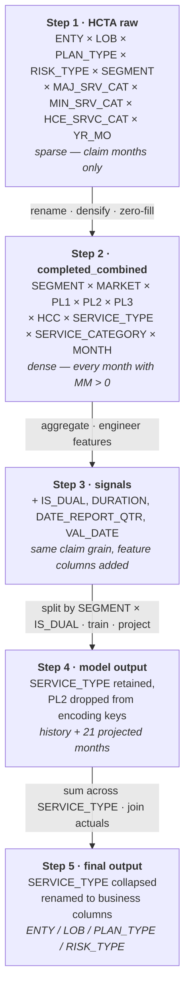

**Densification (Step 1 → 2) is the conceptually important transition.** Claim
data only has rows where claims occurred. Every downstream lag, rolling window,
and zero-count feature assumes a contiguous monthly series — feeding sparse data
into them silently produces wrong answers rather than errors. Step 2 constructs
the complete series and zero-fills the gaps.

---

## 4. Step 1 — Extract HCTA

**File:** `Step_01_Extract_HCTA.py` · **Type:** notebook · ~72 lines

Pulls the HCTA table from Snowflake into Delta and establishes the valuation date
for the entire run.

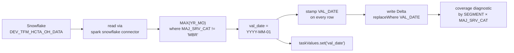

### What it does

```python
sf_options = {
    "sfURL": "uhg_optumcare.east-us-2.azure.snowflakecomputing.com",
    "sfUser": "ryan_shannon@optum.com",
    "sfDatabase": "OCDP_PRD_OCUDL_CCM_HCE_JMJ_DB",
    ...
    "sfPassword": pat_sf_ohc,   # from dbutils.secrets
}
```

Credentials come from `dbutils.secrets` — correct. The **user is a named personal
account**, not a service principal, which ties the pipeline to one person's access.

```python
_max_yrmo = ohc_hcta.filter("MAJ_SRV_CAT != 'MBR'").selectExpr("MAX(YR_MO) AS m").collect()[0]["m"]
val_date = f"{_max_yrmo[:4]}-{_max_yrmo[4:6]}-01"
```

The valuation date is derived from the newest **claim** month, deliberately
excluding `MBR` rows. Membership rows carry prospective enrollment that extends
past the claims history, so including them would set `val_date` into the future.
Good reasoning, and the comment says so.

### The write pattern

```python
writer = df.write.format("delta").option("mergeSchema", "true")
if spark.catalog.tableExists(full_name):
    writer = writer.option("replaceWhere", f"VAL_DATE = DATE('{val_date}')")
writer.mode("overwrite").saveAsTable(full_name)
```

`replaceWhere` is an **atomic partition replacement** — the slice is swapped in a
single transaction. This is materially better than the delete-then-append pattern
used in Steps 4 and 5, where the slice is briefly missing between the two
operations. Steps 1 and 2 use the good idiom; the rest of the pipeline does not.

### Notes

- `select *` pulls every column with no pruning and no incremental predicate — a
  full table transfer on every run.
- If the source hasn't advanced, `val_date` is unchanged and the same slice is
  rewritten with identical data. Nothing detects or reports "no new data."

---

## 5. Step 2 — OHC Completed Combined

**File:** `Step_02_OHC_Completed_Combined.py` · **Type:** notebook · ~527 lines

The most substantial transformation in the pipeline, and the most carefully
validated code in the repository. It reshapes HCTA into the pipeline's column
vocabulary and — critically — densifies sparse claim rows into complete
longitudinal series.

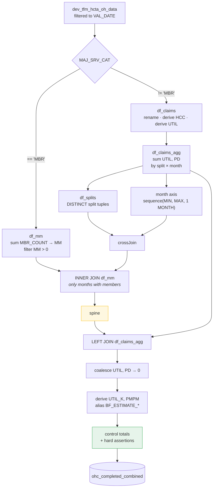

### Column mapping

HCTA uses one vocabulary; the pipeline uses another. Step 2 is the translation
layer.

| HCTA column | Pipeline column | Notes |
|---|---|---|
| `ENTY` | `MARKET` | |
| `LOB` | `PRODUCT_LEVEL_1_TADM` | Line of business |
| `PLAN_TYPE` | `PRODUCT_LEVEL_2_TADM` | |
| `RISK_TYPE` | `PRODUCT_LEVEL_3_TADM` | |
| `MIN_SRV_CAT` | `SERVICE_TYPE` | |
| `HCE_SRVC_CAT` | `SERVICE_CATEGORY` | |
| `NET_AMT_COMP` | `PD` | Paid / allowed dollars |
| `MAJ_SRV_CAT` | `HCC` | Via the collapse below |
| `MBR_COUNT` | `MM` | Member months, from `MBR` rows only |

### HCC normalization

```python
F.when(F.col('MAJ_SRV_CAT').isin('INPATIENT', 'IP'),  F.lit('INPATIENT'))
 .when(F.col('MAJ_SRV_CAT').isin('OUTPATIENT', 'OP'), F.lit('OUTPATIENT'))
 .when(F.col('MAJ_SRV_CAT').isin('PH', 'PHYSICIAN'),  F.lit('PHYSICIAN'))
 .when(F.col('MAJ_SRV_CAT') == 'RX',                  F.lit('PHARMACY'))
 .otherwise(F.col('MAJ_SRV_CAT'))
```

OHC and OC use different abbreviations for the same service categories. Collapsing
them means Step 4's single `hcc: PHYSICIAN` filter covers both source taxonomies.

### The spine — densification

This is the core idea, and the inline comment explains it well:

> Claim rows alone are sparse, which silently corrupts every lag / rolling /
> zero-count feature built downstream in signals_units.

```python
df_spine = (
    df_splits                      # DISTINCT observed split tuples
    .crossJoin(df_months)          # × contiguous month axis
    .join(df_mm, on=MM_SPINE_KEYS, how='inner')   # ∩ months with MM > 0
)
```

Three deliberate constraints:

1. **Only observed split tuples.** The cross join uses splits that actually appear
   in the claims data, so no impossible product × category combination is invented.
2. **`SEGMENT` is part of the split key**, so OHC and OC taxonomies never mix — a
   split only pairs a segment's products with that segment's own categories.
3. **`INNER JOIN` on `MM > 0`.** A split only gets a month if its enrollment group
   actually had members. This bounds the cartesian product and guarantees every
   output row has a valid rate denominator.

Then the claims attach and gaps zero-fill:

```python
.join(df_claims_agg, on=CLAIM_GRAIN, how='left')
.withColumn('UTIL', F.coalesce(F.col('UTIL'), F.lit(0.0)))
.withColumn('PD',   F.coalesce(F.col('PD'),   F.lit(0.0)))
```

A month with members and no claims becomes a genuine zero rather than a missing
row — which is what makes `COUNT_ZEROS_*` in Step 3 meaningful.

### `BF_ESTIMATE_*` are aliases, not estimates

```python
.withColumn('BF_ESTIMATE_UTIL_K', F.col('UTIL_K'))
.withColumn('BF_ESTIMATE_PMPM',   F.col('PMPM'))
```

Despite the Bornhuetter-Ferguson naming, **no completion is applied here** — these
are straight copies of the observed rates. `DURATION` is set to `0` with the
comment *"HCTA data is pre-completed,"* so completion happens upstream in Snowflake.

The naming still propagates a misleading implication all the way to the model
target, since Step 3 does `TARGET_UTIL = BF_ESTIMATE_UTIL_K`. The full chain is:

```
UTIL_K  →  BF_ESTIMATE_UTIL_K  →  TARGET_UTIL
```

Three names, one quantity: the observed utilization rate.

### The UTIL derivation

```python
F.when(F.col('IP_ADMITS_UNITS_TREND') > 0, F.col('IP_ADMITS_UNITS_TREND'))
 .when(F.col('IP_DAYS_UNITS_TREND')   > 0, F.col('IP_DAYS_UNITS_TREND'))
 .when(F.col('OP_VISITS_UNITS_TREND') > 0, F.col('OP_VISITS_UNITS_TREND'))
 .when(F.col('OP_PROC_UNITS_TREND')   > 0, F.col('OP_PROC_UNITS_TREND'))
 .when(F.col('PH_PROC_UNITS_TREND')   > 0, F.col('PH_PROC_UNITS_TREND'))
 .when(F.col('RX_SCRIPT_UNITS_TREND') > 0, F.col('RX_SCRIPT_UNITS_TREND'))
 .otherwise(F.lit(None).cast('double'))
```

First non-zero across six unit columns. This collapses six different units —
admissions, bed days, visits, procedures, scripts — into one `UTIL` column.

Within an HCC this is usually consistent, but **inpatient has two candidates** and
the chain prefers admits. A split with `IP_ADMITS = 0` and `IP_DAYS = 5` silently
switches from admissions to bed days for that month, so the same time series can
change units month to month. Worth understanding before interpreting inpatient
utilization forecasts.

### Control totals — the best validation in the repo

```
Metric                                          Expected     Output   Abs diff   % diff  Assert
MM  (deduped at enrollment grain)                    ...        ...        ...      ...     YES
MM  (enrollment group-months)                        ...        ...        ...      ...     YES
PD  (sum NET_AMT_COMP)                               ...        ...        ...      ...    info
UTIL (health-claim utilization)                      ...        ...        ...      ...    info
Row count (source claim rows)                        ...        ...        ...      ...    info
```

Four hard assertions:

| Assertion | Catches |
|---|---|
| `out_pd <= src_pd` | Dollar inflation from a join fan-out |
| `out_util <= src_util` | Utilization inflation |
| `MM` ties within 0.1% (deduped) | Spine fan-out duplicating membership |
| `_dup_grain == 0` | More than one row per split × month |

`MM` must be deduplicated before summing, because the spine repeats one enrollment
group's `MM` across every claim category in that group. The code handles this
explicitly and explains why.

**Orphan claims** — claims whose enrollment group has no `MBR` match — are excluded
by design (you cannot compute a per-member rate without members) and the excluded
dollar amount is reported as an info metric rather than asserted. That is the right
call: it's an expected, quantified gap rather than a defect.

Densification diagnostics report zero-utilization row share, months per split
(min/median/max), splits with interior gaps, and splits under 24 months.

---

## 6. Step 3 — Signals Units

**File:** `Step_03_Signals_Units.py` · **Type:** Python module · ~416 lines

The feature engineering stage. Structurally different from every other step: a
proper module with private helpers and a public `run()`, no `dbutils`, no
`display()`, and relative imports.

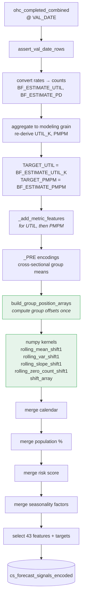

### Rates ↔ counts

```python
source['BF_ESTIMATE_UTIL'] = source['BF_ESTIMATE_UTIL_K'] * (source['MM'] / 12000)
source['BF_ESTIMATE_PD']   = source['BF_ESTIMATE_PMPM'] * source['MM']
```

Rates are not additive; counts are. Aggregating across `SERVICE_TYPE` requires
converting to counts first, then re-deriving rates after the sum. The conversion
here and the re-normalization after `groupby` are two halves of one operation.

### The feature families

| Family | Columns (per metric) | Captures |
|---|---|---|
| Target encodings | `MARKET_ENCODED_*`, `PRODUCT_ENCODED_*`, `CATEGORY_ENCODED_*` (+ `_PRE`) | Rolling historical mean for that dimension |
| Lags | `TARGET_*_1`, `_2`, `_3`, `_12` | Recent momentum + year-over-year anchor |
| Rolling statistics | `COUNT_ZEROS_*`, `VARIANCE_12_MO_*`, `SLOPE_12_*` | Sparsity, volatility, trend |
| Exogenous | `MM`, `WORKDAY`, `MONTH`, 11 demographic %, `PROSP_RISK`, `SEASONAL_FACTOR_*` | Exposure, calendar, population mix, risk |

Target encodings are built in two steps. `_PRE` is a cross-sectional group mean
that includes each row's own target — unsafe on its own. The usable feature is a
12-month rolling mean of `_PRE` **shifted one period**, so it only ever sees
strictly earlier months. Every kernel name carries `_shift1`, making the leakage
guarantee visible at the call site.

### Why this step is fast

```python
group_positions = build_group_position_arrays(out, group)
for pos in group_positions:
    market_encoded[pos] = rolling_mean_shift1(market_pre_values[pos], window=12, min_periods=3)
```

Group membership is resolved **once** into integer position arrays, then reused
across all ten features via numpy fancy indexing. Step 4 performs the same
computations with `groupby().transform(lambda ...)`, re-deriving group membership
every time.

### Population and risk are not dual-stratified

Both merges explicitly drop `IS_DUAL`:

```python
_product_level_no_dual = [c for c in config['cf_product_level'] if c != 'IS_DUAL']
```

So dual and non-dual rows in the same product-month receive identical demographics
and risk scores. Documented in comments. Since Step 4 trains separate models per
`IS_DUAL` value, those features are constant along that dimension within each
model — a real ceiling on what they can contribute.

---

## 7. Step 4 — LightGBM Train

**File:** `Step_04_LightGRM_Train.py` · **Type:** notebook · ~687 lines

Trains models, generates the 21-month projection, computes SHAP, writes two tables.
One notebook run covers **one HCC**.

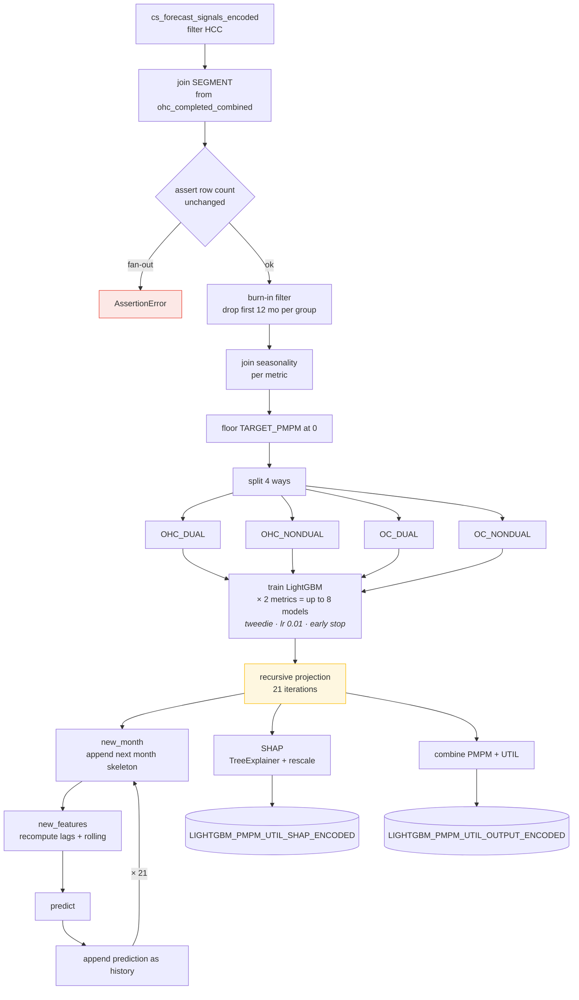

### Model configuration

```python
params = {
    'objective': 'tweedie',      # zero-inflated, right-skewed claims
    'metric': 'rmse',            # early-stopping criterion
    'boosting_type': 'gbdt',
    'learning_rate': 0.01,
    'num_leaves': 31,
    'max_depth': 6,
    'feature_fraction': 0.8,
    'bagging_fraction': 0.8,
    'bagging_freq': 5,
    'early_stopping_rounds': 100,
}
```

**Tweedie** is the right objective family for healthcare claims — a compound
Poisson-gamma distribution handles the point mass at zero plus a continuous
positive tail. Note that the *evaluation* metric is RMSE, so training and early
stopping optimize different things.

### Why four splits

Dual-eligible members (Medicare + Medicaid) have materially different cost and
utilization patterns, and OHC vs OC is a distinct organizational split. Training
separately means the model doesn't spend splits recovering a distinction already
known. The cost is fewer rows per model.

### Recursive projection

The models predict one month ahead; the output needs 21. Each iteration appends
the prediction to history **under the same column name as the actuals**, so the
next iteration's lag features populate without special-casing.

Two consequences:

- **Error compounds.** Month 21's features are built almost entirely from predicted
  values. The output carries no interval to express this.
- Runtime scales with `21 × splits × metrics`.

### SHAP rescaling

Tweedie uses a log link, so raw SHAP values live in log space and don't sum to the
prediction in dollar space. The notebook rescales each contribution to its share of
total impact applied to `prediction − expected_value`:

```python
shap_adjusted[col] = (shap_adjusted[col] / total_impact) * (target - expected_value)
```

Contributions then sum exactly to the prediction in business units — which is what
makes the table usable in a BI tool. The trade-off: these are proportionally
rescaled approximations, not strict additive attributions. Feature ranking survives;
exact magnitudes are a projection.

---

## 8. Step 5 — Final Output

**File:** `Step_05_Final_Output.py` · **Type:** notebook · ~107 lines

Turns model output into the business-facing reporting table. Pure Spark, no pandas —
it runs in a fraction of Step 4's time.

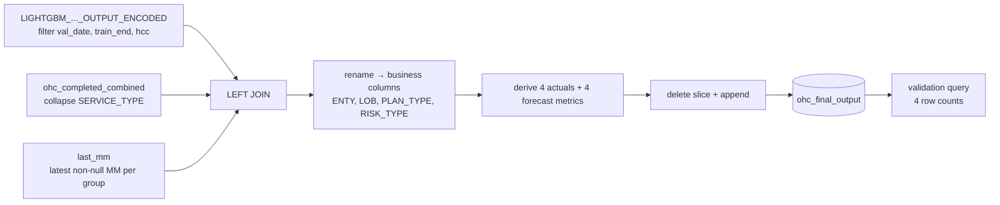

### The published metrics

| Column | Formula | Reading |
|---|---|---|
| `OH_ACTUALS_UTIL` | raw | Service count |
| `OH_ACTUALS_UTIL_K` | `UTIL × 12000 / MM` | Services per 1,000 members per year |
| `OH_ACTUALS_UNIT_COST` | `PD / UTIL` | Average cost per service |
| `OH_ACTUALS_ALLOWED_PMPM` | `PD / MM` | Allowed dollars per member per month |
| `OH_FCST_UTIL` | `pred_util / 12000 × mm` | Predicted service count |
| `OH_FCST_UTIL_K` | raw prediction | Predicted services per 1,000 |
| `OH_FCST_UNIT_COST` | `pred_pmpm × 12000 / pred_util` | Predicted cost per service |
| `OH_FCST_ALLOWED_PMPM` | raw prediction | Predicted PMPM |

`12000` = 1,000 members × 12 months, the standard actuarial annualization.

Actuals and forecast metrics are defined in parallel so a dashboard can plot them
on one axis.

### Member-month carry-forward

```python
w = Window.partitionBy(*GROUP_KEYS).orderBy(F.desc('DATE_REPORT_MONTH'))
last_mm = actuals.filter(F.col('MM').isNotNull()).withColumn('rn', F.row_number().over(w)).filter('rn = 1')
mm = F.coalesce(F.col('MM'), F.col('LAST_MM'))
```

Projection months have no membership data, so each group's most recent known `MM`
is held flat forward. **This assumes stable enrollment for up to 21 months** — fine
for a steady book, materially wrong for a market in growth or runoff.

`MM IS NULL` is what distinguishes a projection row from a historical one, which is
exactly what the validation query counts.

### Divide-by-zero guard

```python
nz = lambda c: F.when(c != 0, c)     # NULLIF(c, 0)
```

`F.when` without `.otherwise()` returns null for non-matching rows, so a zero
denominator produces a clean null rather than an error or infinity. Used on every
division. Step 3 has no equivalent.

---

## 9. External input: seasonality factors

`SEASONALITY_ADJUSTMENT.py` lives outside `Databricks_Pipeline/` and is **not part
of the workflow** — it is run ad hoc and its output table is read by Steps 3 and 4.

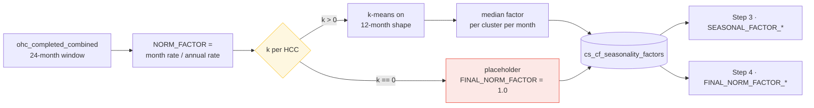

**Every `k` is currently `0`,** so all eight HCC × metric combinations take the
placeholder branch and the published factors are uniformly `1.0`. The clustering
code never executes. Consequences:

- `SEASONAL_FACTOR_UTIL` / `SEASONAL_FACTOR_PMPM` in Step 3 are constant columns
- `FINAL_NORM_FACTOR_*` in Step 4 is a zero-variance feature — LightGBM cannot
  split on it, so it contributes nothing
- Every downstream `fillna(1.0)` fallback is indistinguishable from a real factor,
  so nothing surfaces the state

The table is also written with a **full overwrite and no `VAL_DATE`**, unlike every
other table in the pipeline. There is no way to determine which factors a past
forecast used.

---

## 10. Orchestration and parameter flow

This is where the pipeline is least coherent. Three different mechanisms are in
play, and the `val_date` chain does not run end to end.

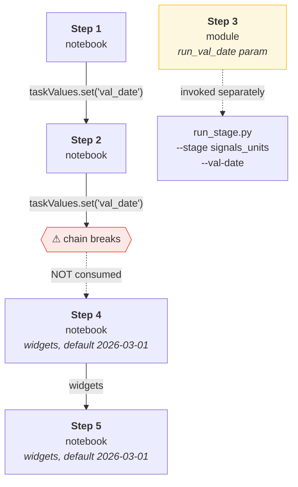

| Step | Type | Parameter source | Consumes upstream `val_date`? |
|---|---|---|---|
| 1 | Notebook | Derived from data | n/a — it originates it |
| 2 | Notebook | `taskValues.get("extract_hcta")` | **Yes** |
| 3 | Module | `run()` arguments via `run_stage.py` | Via `--val-date`, set manually |
| 4 | Notebook | `dbutils.widgets` | **No** — default `"2026-03-01"` |
| 5 | Notebook | `dbutils.widgets` | **No** — default `"2026-03-01"` |

**Steps 4 and 5 never read the task value.** They rely on widgets whose defaults are
hardcoded dates. If the widgets aren't set to match the run, Step 4 trains on the
wrong vintage and Step 5's triple filter matches zero rows and writes an empty
result — successfully, with no error.

**Step 3 cannot run as a notebook.** Its relative imports (`from .numpy_time_series_utils
import ...`) require package context, so it must be invoked through `run_stage.py`.
The pipeline therefore requires both a Workflow task graph and a separate module
entry point.

### The run_stage.py divergence

`run_stage.py` (outside this folder) defines five stages: `completion`, `valuation`,
`signals_units`, `lightgbm_train`, `lightgbm_predict`. Only `signals_units` overlaps
with this pipeline. The notebook path has no `completion` or `valuation` stage —
consistent with Step 2 setting `DURATION = 0` and aliasing `BF_ESTIMATE_*`, since
completion is handled upstream in Snowflake.

Two paths that partly overlap and partly don't. Worth deciding which is
authoritative before either is extended.

---

## 11. Glossary

| Term | Meaning |
|---|---|
| **HCTA** | Health Care Trend Analytics — the Snowflake source dataset |
| **HCC** | Major service category (`INPATIENT`, `OUTPATIENT`, `PHYSICIAN`, `PHARMACY`). *Not* Hierarchical Condition Category |
| **MM** | Member months — one member enrolled for one month. The exposure denominator |
| **PMPM** | Per member per month — allowed dollars ÷ member months |
| **UTIL_K** | Utilization per 1,000 members per year: `UTIL × 12000 / MM` |
| **PD** | Paid / allowed dollars (`NET_AMT_COMP` in HCTA) |
| **BF estimate** | Bornhuetter-Ferguson completion estimate. **In this pipeline, an alias for the observed rate** |
| **Dual** | Dual-eligible — qualifies for both Medicare and Medicaid. Higher acuity, different utilization |
| **DSNP / MMP** | Dual Special Needs Plan / Medicare-Medicaid Plan. Drives `IS_DUAL = 1` |
| **Segment** | `OHC` or `OC` — organizational split with distinct claim taxonomies |
| **Split** | One longitudinal series: segment × market × 3 product levels × HCC × service type × service category |
| **Spine** | The dense split × month scaffold built in Step 2 |
| **Orphan claim** | A claim whose enrollment group has no matching `MBR` row — excluded, since no rate denominator exists |
| **val_date** | Data vintage marker — which snapshot of the source produced this row |
| **train_end** | Last experience month included in training. A modeling choice, distinct from `val_date` |
| **Burn-in** | First 12 months per group, discarded so rolling features are fully populated |
| **12000** | 1,000 members × 12 months — the annualization constant |
| **SHAP** | Shapley additive explanations — per-feature contribution to a prediction |
| **Tweedie** | Compound Poisson-gamma distribution; handles zero-inflated positive-skewed data |

---

## 12. Data dictionary

### `ohc_completed_combined` (Step 2 output)

| Column | Type | Description |
|---|---|---|
| `MARKET` | string | Geographic market (`ENTY` in HCTA) |
| `PRODUCT_LEVEL_1_TADM` | string | Line of business |
| `PRODUCT_LEVEL_2_TADM` | string | Plan type — drives `IS_DUAL` |
| `PRODUCT_LEVEL_3_TADM` | string | Risk type |
| `SEGMENT` | string | `OHC` or `OC` |
| `IS_DUAL` | bigint | 1 when plan type is DSNP/MMP, else 0 |
| `HCC` | string | Normalized major service category |
| `SERVICE_TYPE` | string | Minor service category |
| `SERVICE_CATEGORY` | string | HCE service category |
| `DATE_REPORT_QTR` | string | `YYYYQn` |
| `DATE_REPORT_MONTH` | date | First of month |
| `DURATION` | bigint | Always 0 — HCTA is pre-completed |
| `VAL_DATE` | date | Data vintage |
| `MM` | double | Member months |
| `UTIL` | double | Service count, zero-filled |
| `PD` | double | Allowed dollars, zero-filled |
| `UTIL_K` | double | `UTIL × 12000 / MM` |
| `PMPM` | double | `PD / MM` |
| `BF_ESTIMATE_UTIL_K` | double | Alias of `UTIL_K` |
| `BF_ESTIMATE_PMPM` | double | Alias of `PMPM` |

### `ohc_final_output` (Step 5 output)

| Column | Description |
|---|---|
| `ENTY` | Market |
| `LOB` | Line of business |
| `PLAN_TYPE` | Product level 2 |
| `RISK_TYPE` | Product level 3 |
| `MAJ_SRV_CAT` | HCC |
| `SEGMENT` | OHC / OC |
| `HCE_SRVC_CAT` | Service category |
| `YR_MO` | Report month |
| `MM` | Member months — actual, or carried forward in projection months |
| `OH_ACTUALS_*` | Four actuals metrics — **null in projection months** |
| `OH_FCST_*` | Four forecast metrics |
| `VAL_DATE`, `TRAIN_END`, `TRAIN_START_LEAD` | Run metadata |
| `PROJECTION_START`, `PROJECTION_END`, `RUN_TIMESTAMP` | Run metadata |
| `N_TRAIN_MONTHS` | Months of history behind this group — use to gauge confidence |

---

## 13. Runbook

### Normal monthly execution

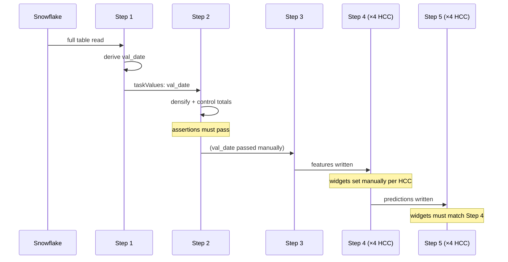

**Per run, verify in order:**

1. **Step 1** — coverage diagnostic shows the expected month range per segment;
   `val_date` advanced from last run.
2. **Step 2** — all four assertions pass. Check the orphan gap and enrollment
   coverage percentages against prior runs; a sudden jump means an upstream join
   key changed.
3. **Step 2** — densification diagnostics: `splits_under_24_mo` and
   `splits_with_gaps` should be stable month over month.
4. **Step 3** — `rows_written` in the returned dict is non-zero and in line with
   prior runs.
5. **Step 4** — read the `skipped_splits` printout. A silently skipped split means
   a segment of the book has no forecast.
6. **Step 5** — the validation query. `total_rows = 0` means the widget parameters
   did not match a training run.

### Parameters to set per run

| Step | Parameter | Set to |
|---|---|---|
| 3 | `--val-date` | The `val_date` Step 1 derived |
| 4 | `val_date` widget | Same |
| 4 | `train_end` widget | Last experience month for training |
| 4 | `hcc` widget | One of `PHYSICIAN`, `OUTPATIENT`, `INPATIENT`, `PHARMACY` |
| 5 | all three widgets | **Must exactly match Step 4** |

### Common failure modes

| Symptom | Likely cause |
|---|---|
| Step 2 `NameError: df_raw` | The `f_raw` typo on line 1 — see below |
| Step 2 assertion on `MM` | Spine fan-out — check for duplicate `MBR` rows at the enrollment grain |
| Step 2 `PD INFLATION` | A join key changed upstream, duplicating claim rows |
| Step 4 `skipped_splits` non-empty | A split has too little data after burn-in |
| Step 5 `total_rows = 0` | Widget parameters don't match any Step 4 run |
| Step 5 `rows_missing_forecast > 0` | A split was skipped in Step 4 |
| Forecast looks flat / no seasonality | Expected — factors are all 1.0 |

---

## 14. Known issues at a glance

Detailed treatment and fixes are in `PIPELINE_IMPROVEMENTS.md`; sequencing is in
`PIPELINE_ROADMAP.md`.

| Severity | Issue | Step |
|---|---|---|
| **Critical** | `f_raw = spark.table(...)` typo on line 1; line 19 reads `df_raw` → `NameError` on any clean run | 2 |
| **Critical** | Bare `Write to table` on line 456 — the file is not valid Python | 2 |
| **Critical** | `val_date` task value is not consumed by Steps 4 or 5; widgets default to a hardcoded date | 4, 5 |
| **High** | Seasonality factors are uniformly 1.0 — the feature is inert | 3, 4 |
| **High** | Trained models are never saved; no seed is set, so runs aren't reproducible | 4 |
| **High** | Historical rows carry actuals in `_PREDICTED` columns | 4 → 5 |
| **High** | Step 5 writes an empty result successfully when parameters don't match | 5 |
| **Medium** | `UTIL` mixes six unit types; inpatient can switch units month to month | 2 |
| **Medium** | `BF_ESTIMATE_*` naming implies completion that isn't applied | 2 |
| **Medium** | No validation metrics are computed or stored anywhere | 4 |
| **Medium** | Delete-then-append in Steps 4–5 is non-atomic; Steps 1–2 use `replaceWhere` | 4, 5 |
| **Medium** | Personal Snowflake account rather than a service principal | 1 |
| **Low** | `_add_rolling_quarter_fields` computes 7 columns nothing consumes | 3 |
| **Low** | Six divisions by `MM` with no zero guard | 3 |
