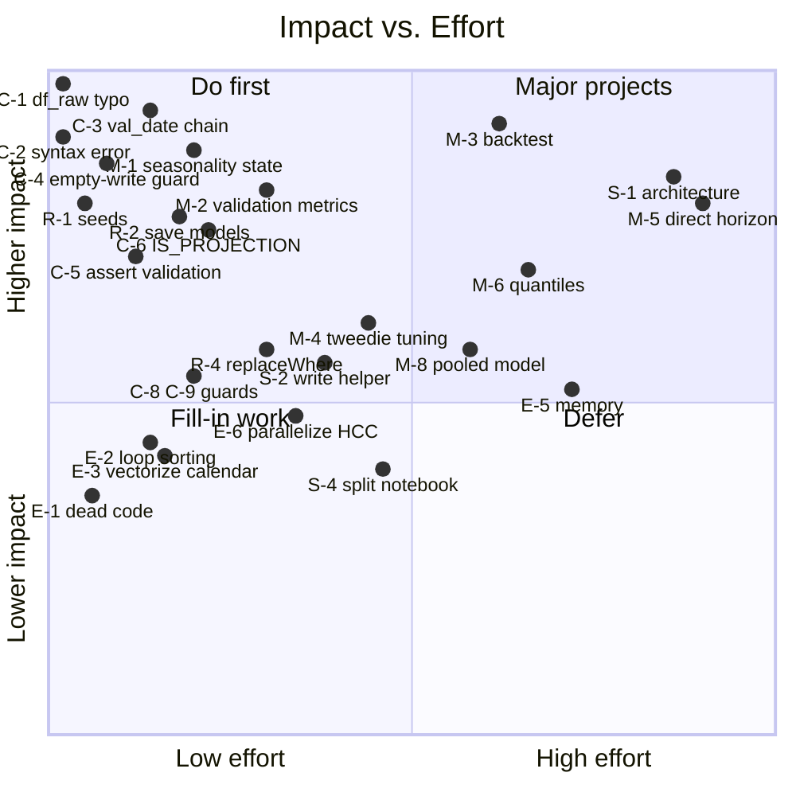
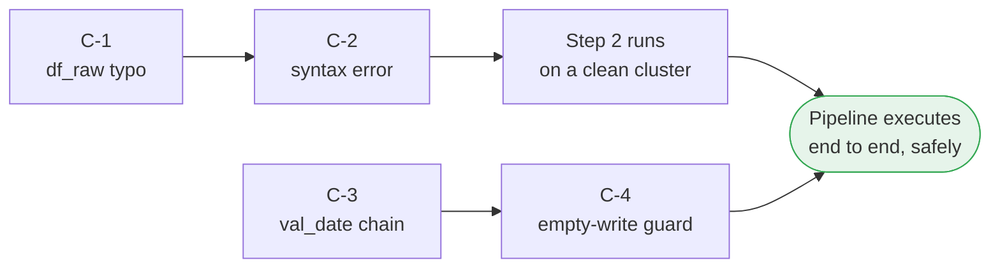
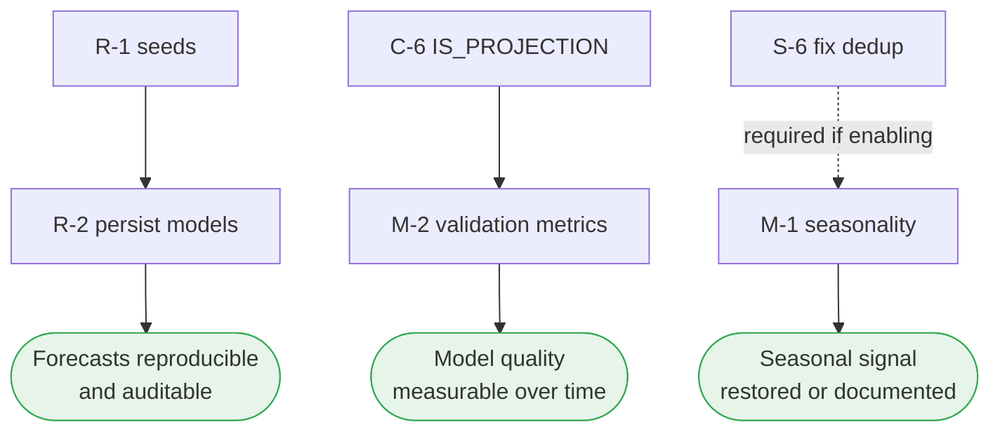
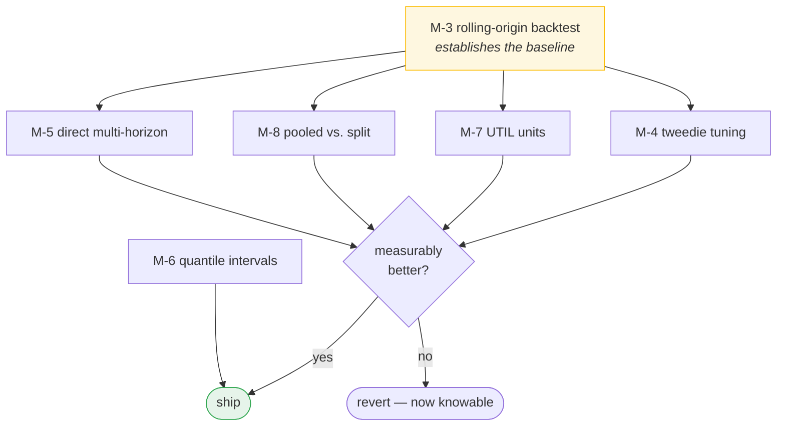
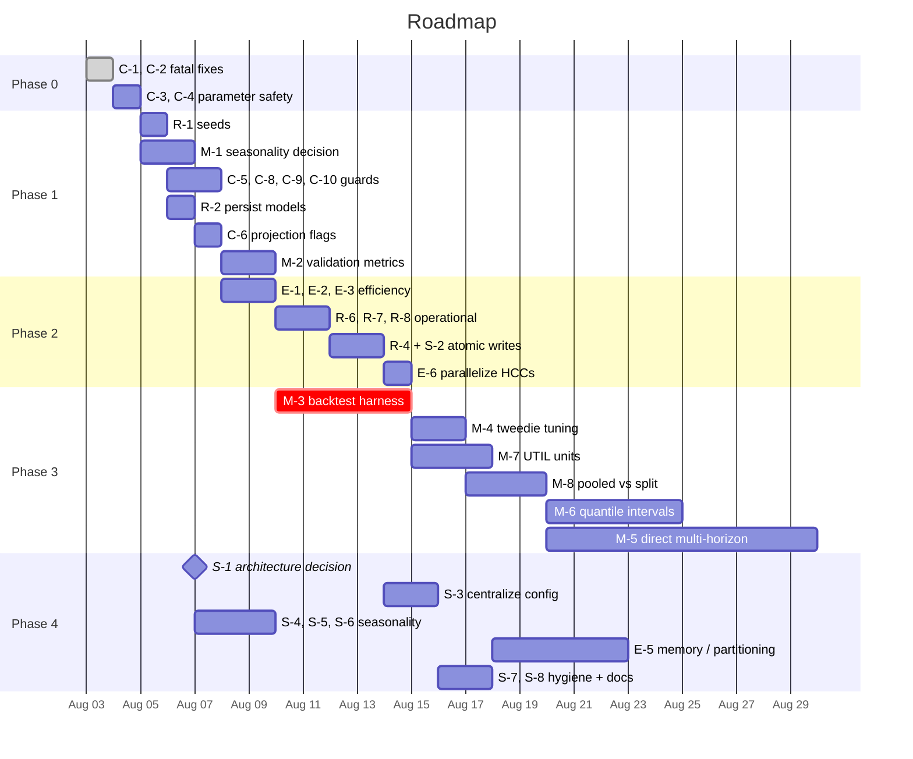

# Pipeline Roadmap — Prioritized Improvements

Sequencing for the recommendations in `PIPELINE_IMPROVEMENTS.md`. IDs match that
document.

**Ranking basis:** impact first (does this change whether the output is correct or
trustworthy?), then effort, then dependency order. A cheap fix that prevents a silent
wrong answer outranks an expensive one that makes a right answer faster.

---

## Impact vs. effort

---

## Phase 0 — Stop the bleeding

**Roughly a day. Nothing else should start before this lands.**

These four are cheap and each prevents a class of silent or fatal failure.

| Rank | ID | Item | Effort | Why now |
|---|---|---|---|---|
| 1 | **C-1** | Fix `f_raw` → `df_raw` | 1 char | Step 2 raises `NameError` on any clean run. Currently works only off stale kernel state. |
| 2 | **C-2** | Comment out `Write to table` | 1 char | Step 2 is not valid Python — cannot be linted, tested, or imported. |
| 3 | **C-3** | Consume `val_date` task value in Steps 4–5 | ~10 lines × 2 | The automated chain stops after Step 2. Widgets default to a hardcoded date. |
| 4 | **C-4** | Raise on empty result in Step 5 | ~6 lines | Parameter mismatch currently writes an empty table and reports success. |

**Why this order:** C-1 and C-2 are prerequisites for running Step 2 at all. C-3
removes the most likely source of a wrong-vintage run; C-4 catches whatever C-3
misses.

---

## Phase 1 — Make results trustworthy

**Roughly a week.** After this phase, a forecast can be reproduced, audited, and
assessed.

| Rank | ID | Item | Effort | Why |
|---|---|---|---|---|
| 5 | **R-1** | Set LightGBM seeds | 4 lines | Two runs on identical inputs currently differ. Hard to defend for financial planning. |
| 6 | **M-1** | Resolve the seasonality state | Decision + ~10 lines | All factors are 1.0; the feature is inert. Domain knowledge says the signal is real. |
| 7 | **C-5** | Assert on Step 5's validation query | ~12 lines | The right four metrics already exist — they just don't gate anything. |
| 8 | **R-2** | Persist trained models | ~8 lines | Models are discarded. With R-1 unfixed, a forecast can't even be reproduced by retraining. |
| 9 | **C-6** | Add `IS_PROJECTION` / `HORIZON_MONTH` | ~12 lines | Historical rows carry actuals in `_PREDICTED` columns — accuracy assessment is impossible today. |
| 10 | **M-2** | Compute and store validation metrics | ~1 day | No way to answer "is this month's model better than last month's." |
| 11 | **C-8**, **C-9** | Zero guard and merge fan-out checks in Step 3 | ~20 lines | Step 2 and Step 4 both assert on these; Step 3 is the gap. |
| 12 | **C-10** | Reconcile the 12-month lag fallback | ~5 lines | Model trains on `NaN`, scores against mean-filled. Silent degradation. |

**Dependency note:** M-1 requires **S-6** (fix the seasonality dedup) if the decision
is to enable clustering. The current `drop_duplicates` keeps an arbitrary row per key —
harmless at 1.0, silently lossy the moment factors vary.

---

## Phase 2 — Efficiency and operational safety

**Roughly a week.** Mostly independent of Phase 1 — can run in parallel if there's
capacity.

| Rank | ID | Item | Effort | Payoff |
|---|---|---|---|---|
| 13 | **E-1** | Delete `_add_rolling_quarter_fields` | 10 min | 3 groupby-rolling ops with zero consumers |
| 14 | **E-2** | Fix Step 4's projection loop sorting | ~15 lines | 21 full re-sorts per split per metric; one is pure waste |
| 15 | **E-3** | Vectorize Step 4's calendar lookups | ~10 lines | Up to 504 row-wise passes per run → scalar assignments |
| 16 | **R-8** | Non-`SUCCESS` stages exit non-zero | ~5 lines | Failed stages currently exit 0; task dependencies are decorative |
| 17 | **R-6** | Detect a non-advancing source | ~8 lines | A stale source silently reproduces last month's forecast |
| 18 | **R-4** | Adopt `replaceWhere` in Steps 4–5 | ~1 day | Non-atomic writes leave slices briefly missing |
| 19 | **E-6** | Parallelize Steps 4–5 across HCCs | Config | ~4× wall clock, no correctness cost |
| 20 | **R-7** | Validate config before Spark starts | ~20 lines | Fail in seconds, not minutes |
| 21 | **C-7** | Guard `F.first('MM')` in Step 5 | ~10 lines | Currently correct, silently wrong if the invariant breaks |
| 22 | **E-4** | Column-prune the Snowflake extract | ~1 hr | `select *` transfers everything every run |
| 23 | **E-7** | Remove Step 3's redundant regroup | 15 min | A no-op groupby over already-grouped data |
| 24 | **R-5** | Move to a Snowflake service principal | Coordination | Pipeline is tied to one person's access |

**R-4 is best done as part of S-2** (the shared write helper) rather than five times
separately — see Phase 4.

---

## Phase 3 — Model accuracy

**Two to four weeks.** This is where forecast quality actually improves, but every
item needs M-3 first to know whether a change helped.

| Rank | ID | Item | Effort | Why this order |
|---|---|---|---|---|
| 25 | **M-3** | Rolling-origin backtest | ~1 week | **The gate for everything below.** Without it, no change can be shown to help. Also the only way to know if the 21-month horizon is trustworthy at all. |
| 26 | **M-4** | Align objective/metric, tune `tweedie_variance_power` | ~2 days | Cheapest accuracy win. The variance power was inherited, never chosen. |
| 27 | **M-7** | Address `UTIL` unit mixing | ~3 days | Inpatient series can switch between admissions and bed days mid-history |
| 28 | **M-9** | Guard the SHAP rescaling | ~2 hrs | Near-zero total impact currently produces exploded values |
| 29 | **M-6** | Quantile models for prediction intervals | ~1 week | 3× models, but consumers finally see the fan widen with horizon |
| 30 | **M-8** | Test pooled vs. four-way split | ~3 days | If pooling wins: 4× faster training and the skipped-split failure mode disappears |
| 31 | **M-5** | Evaluate direct multi-horizon forecasting | ~2 weeks | Standard practice for long horizons precisely because of compounding. Biggest potential accuracy gain, biggest change. |

**M-3 before anything else in this phase.** Right now there is no way to tell whether
a modeling change helped or hurt — which means any tuning is guesswork, and a
regression could ship unnoticed.

---

## Phase 4 — Structural

**Ongoing.** Lower urgency, high long-term leverage. S-1 should be *decided* early
even if executed late, because it determines the shape of everything else.

| Rank | ID | Item | Effort | Note |
|---|---|---|---|---|
| 32 | **S-1** | Decide notebook path vs. module path | Decision | **Decide in Phase 0–1.** Blocks S-2 and S-3. Step 3 can't run as a notebook, so the pipeline currently needs both mechanisms. |
| 33 | **S-2** | Extract a shared write helper | ~1 day | Five copies of the write logic with small divergences. Fold R-4 in here. |
| 34 | **S-3** | Centralize configuration | ~2 days | Step 3 is config-driven; Steps 1, 2, 4, 5 hardcode names. Makes prod promotion a config change. |
| 35 | **S-6** | Fix the seasonality dedup | ~1 hr | **Prerequisite for M-1** if clustering is enabled |
| 36 | **S-4** | Split the seasonality notebook | ~1 day | ~250 lines of exploration run on every execution; 3 functions defined twice |
| 37 | **S-5** | Wire seasonality validation into a release gate | ~1 day | Friedman test and residual slope/R² already written, gating nothing |
| 38 | **E-5** | Bound driver memory / partition Step 3 by HCC | ~1 week | The scaling ceiling. Fails as OOM, not slowdown. |
| 39 | **S-8** | Column comments on published tables | ~2 hrs | `OH_FCST_UNIT_COST` is the least reliable number in the table and is unmarked |
| 40 | **S-7** | Code hygiene sweep | ~1 day | Dead imports, unreachable branches, deprecated APIs, `assert` → `raise` |

---

## Suggested sequence

---

## Top ten, if you only do ten

| # | ID | Item | Rationale |
|---|---|---|---|
| 1 | C-1 | Fix the `df_raw` typo | Step 2 fails on any clean run |
| 2 | C-2 | Fix the syntax error | Step 2 isn't valid Python |
| 3 | C-3 | Wire `val_date` into Steps 4–5 | Removes the most likely wrong-vintage run |
| 4 | C-4 | Raise on empty write | Catches what C-3 misses |
| 5 | R-1 | Set LightGBM seeds | Four lines buys reproducibility |
| 6 | M-1 | Resolve the seasonality state | A whole feature family is currently inert |
| 7 | R-2 | Persist trained models | Makes forecasts auditable |
| 8 | C-6 | Flag projection vs. history | Makes accuracy assessment possible at all |
| 9 | M-2 | Store validation metrics | Makes model quality trackable |
| 10 | M-3 | Build the backtest harness | Turns every future change from guesswork into measurement |

Items 1–5 are roughly a day and a half of work combined, and they address every known
path to a silently wrong or unreproducible result. Items 6–10 are what make the
forecast defensible to someone who asks how good it is.

---

## What's deliberately not on this list

A few things that look like problems but are working as intended:

- **Orphan claim exclusion in Step 2.** Claims with no matching `MBR` row are dropped
  because a per-member rate needs a denominator. The excluded amount is quantified and
  reported. Correct, and well documented.
- **`SERVICE_TYPE` collapse in Step 5.** The model doesn't forecast at that grain, so
  aggregating is necessary. The dimension is available upstream if needed.
- **The four-way population split.** M-8 proposes *testing* an alternative, not
  replacing it. Dual and OHC/OC populations genuinely behave differently, and the
  current design encodes real domain knowledge.
- **Tweedie objective.** The right distributional family for zero-inflated,
  right-skewed claims. M-4 tunes its variance power rather than questioning the choice.
- **Step 2's control totals.** The strongest validation code in the repository. The
  only recommendation touching it is S-7's `assert` → `raise` conversion.
