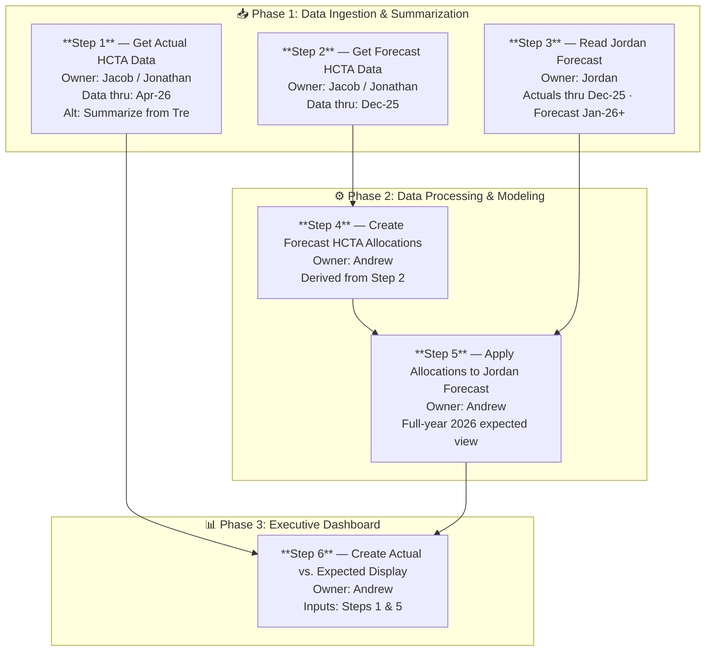

# Actual vs. Expected Medical Expense Reporting Solution
## Project Plan — Healthcare Payer Analytics
**Target Completion: June 1, 2026**

---

## 1. Executive Summary

This project delivers an Actual vs. Expected (A/E) medical expense reporting capability for a healthcare payer. The solution ingests and reconciles two distinct data streams — HCTA-sourced actuals and a financial forecast from Jordan — processes them in Databricks to produce allocation-adjusted expected values, and surfaces the results in an executive-grade interactive display.

The work spans three sequential phases:
- **Phase 1: Data Ingestion & Summarization** — pull and validate all source data in Databricks.
- **Phase 2: Data Processing & Modeling** — build allocation logic and produce the final A/E datasets.
- **Phase 3: Executive Dashboard** — deliver a filterable, drillable display for stakeholders.

All six steps are due by June 1, 2026. Owner assignments are Jacob/Jonathan (data sourcing), Jordan (financial forecast), and Andrew (processing, modeling, and display).

---

## 2. Process Flow

The diagram below shows how the six steps relate to each other across the three phases. Steps 1, 2, and 3 can be worked in parallel; Step 4 depends on Step 2; Step 5 converges Steps 3 and 4; and Step 6 is the final join of Steps 1 and 5.

---

## 3. Project Overview

### 3.1 Objective

Produce a reliable, refreshable view that compares actual medical expenses against expected (forecast-derived) amounts at granular dimensions — enabling payer leadership to quickly identify where costs are tracking above or below plan and investigate drivers.

### 3.2 Key Stakeholders

- **Jacob / Jonathan** — HCTA data owners; responsible for delivering actuals (Step 1) and forecast HCTA data (Step 2).
- **Jordan** — Financial source-of-truth owner; responsible for the full-year 2026 forecast file (Step 3).
- **Andrew** — Lead analyst / engineer; owns all Databricks processing (Steps 4 & 5) and the final display (Step 6).
- **Executive Leadership / Analysts** — end consumers of the A/E dashboard.

### 3.3 High-Level Timeline

- **Steps 1–3 (Ingestion):** Complete data pulls and reconciliation validation prior to processing.
- **Steps 4–5 (Processing):** Build allocation model and apply to 2026 forecast; full-year 2026 dataset as output.
- **Step 6 (Display):** Deliver Actual vs. Expected dashboard.
- **Overall Due Date:** June 1, 2026.

---

## 4. Phase 1: Data Ingestion & Summarization

Phase 1 establishes the foundation by ingesting all required source datasets into Databricks and verifying they are consistent before any processing begins.

---

### Step 1 — Get Actual HCTA Completed Data

| Attribute | Detail |
|---|---|
| **Owner** | Jacob / Jonathan |
| **Data Through** | April 2026 |
| **Primary Source** | HCTA system (Jacob / Jonathan) |
| **Alt Source** | Summarize directly from Tre if HCTA feed is unavailable |

**Key tasks:**
- Confirm data extract format and field definitions with Jacob/Jonathan.
- Ingest the HCTA actuals file into a Databricks Delta table (e.g., `hcta_actuals`).
  - Validate row counts, date ranges, and key financial fields (paid amounts, member months, claim counts).
  - Document any known lags between incurred date and paid/completed date.
- If HCTA data is unavailable, execute the alternate path: summarize actuals from Tre and document the reconciliation basis.
- Tag data-through date (April 2026) as metadata on the Delta table for downstream traceability.

---

### Step 2 — Get Forecast HCTA Completed Data

| Attribute | Detail |
|---|---|
| **Owner** | Jacob / Jonathan |
| **Data Through** | December 2025 |
| **Purpose** | Allocate forecast dollars (drives allocation keys in Step 4) |

**Key tasks:**
- Obtain forecast-period HCTA data (through December 2025) from Jacob/Jonathan.
- Ingest into Databricks Delta table (e.g., `hcta_forecast_hcta`) with clear labeling as forecast-period data.
  - Confirm all allocation-relevant dimensions are present: line of business, member segment, geography, service category.
- Validate that the forecast HCTA data is appropriate for deriving allocation percentages — flag any sparse cells or categories with zero/nominal values.
- This dataset is the basis for the allocation methodology in Step 4 and must be locked before Step 4 begins.

---

### Step 3 — Read in Forecast from Jordan

| Attribute | Detail |
|---|---|
| **Owner** | Jordan |
| **Data Coverage** | Actuals through December 2025; Forecast January 2026 forward |
| **Source Role** | Financial Source of Truth for the organization |
| **Key Question** | Do Jordan historicals reconcile to HCTA historicals? |

**Key tasks:**
- Obtain full forecast file from Jordan covering actuals through Dec-25 and forecast through Dec-26.
- Ingest into Databricks (e.g., `jordan_forecast`) preserving the actuals/forecast period distinction.
- **Critical reconciliation check:** compare Jordan historicals (through Dec-25) to HCTA actuals for the overlapping period.
  - Differences should be investigated and documented before proceeding to Phase 2.
  - Expect alignment given Jordan is the Financial Source of Truth, but surface any gaps immediately.
- Confirm the forecast extends through December 2026 — required for Step 5 to produce a full-year view.

---

### 4.1 Phase 1 Exit Criteria

- All three datasets are loaded into Databricks Delta tables with correct schemas and date ranges.
- HCTA actuals vs. Jordan historical reconciliation is documented (differences < acceptable threshold or explained).
- Data quality checks passed: no unexpected nulls in key financial/dimensional fields.
- Sign-off from Jacob/Jonathan and Jordan that their respective datasets are final.

---

## 5. Phase 2: Data Processing & Modeling

Phase 2 transforms the ingested data into the allocation-adjusted forecast dataset that will power the A/E comparison. All work in this phase is owned by Andrew.

---

### Step 4 — Create Forecast HCTA Allocations

| Attribute | Detail |
|---|---|
| **Owner** | Andrew |
| **Input** | Step 2: Forecast HCTA completed data |
| **Output** | Allocation keys / percentages by dimension for applying to Jordan forecast |

**Key tasks:**
- Define allocation methodology: how HCTA forecast data (Step 2) is used to derive percentage splits across dimensions (e.g., line of business, geography, service category).
  - Document methodology assumptions in a shared reference document and obtain stakeholder sign-off before proceeding.
- Build Databricks notebook/job to compute allocation keys from `hcta_forecast_hcta`.
  - Output: `allocation_keys` table with dimensions and percentage weights.
- Validate allocation keys sum to 100% within each applicable grouping.
- Peer review the allocation logic with Jacob/Jonathan to confirm it accurately reflects the intended methodology.

---

### Step 5 — Apply Step 4 Allocations to 2026 Q1 Jordan Forecast

| Attribute | Detail |
|---|---|
| **Owner** | Andrew |
| **Inputs** | Step 3 (Jordan forecast) + Step 4 (allocation keys) |
| **Output** | Allocated expected expense by dimension through December 2026 |
| **Forecast Horizon** | Full year 2026 (end of 2026) |

**Key tasks:**
- Join `jordan_forecast` with `allocation_keys` on shared dimensions to distribute Jordan forecast totals across HCTA allocation categories.
  - Produce `expected_allocated` table: allocated expected expense by period, line of business, segment, geography, etc.
- Validate that allocated totals roll up to match Jordan forecast grand totals (no dollars added or lost).
- Ensure full-year 2026 coverage — confirm no months are missing in the output.
- Register the `expected_allocated` table as the canonical "Expected" dataset for Step 6.

---

### 5.1 Phase 2 Exit Criteria

- Allocation keys are documented, validated, and approved.
- `expected_allocated` table covers Jan 2026 through Dec 2026 with no gaps.
- Rollup reconciliation confirms allocated totals equal Jordan forecast totals.
- Andrew confirms the output is ready for display layer consumption.

---

## 6. Phase 3: Executive Dashboard / UI

Phase 3 delivers the user-facing Actual vs. Expected display. The interface must allow non-technical executive users to explore the data interactively while also supporting deeper analyst investigation.

---

### Step 6 — Create Actual vs. Expected Display

| Attribute | Detail |
|---|---|
| **Owner** | Andrew |
| **Input Datasets** | Step 1 (HCTA actuals) + Step 5 (allocated expected) |
| **Primary Output** | Interactive A/E dashboard / report for executive and analyst use |

#### 6.1 Core A/E Metrics

- Actual Medical Expense (from Step 1 HCTA actuals)
- Expected Medical Expense (from Step 5 allocated Jordan forecast)
- Variance: Actual minus Expected ($)
- A/E Ratio: Actual / Expected (%)
- Members / Member Months (for per-member normalization)

#### 6.2 Filter & Drill Dimensions

The display should support filtering and slicing across at minimum the following dimensions:
- **Time Period** — month, quarter, year-to-date; comparison to prior period or prior year
- **Line of Business** — e.g., Commercial, Medicare Advantage, Medicaid
- **Member Segment** — e.g., age band, risk tier, benefit plan
- **Geography** — e.g., region, market, state
- **Claim / Service Category** — e.g., inpatient, outpatient, pharmacy, professional

#### 6.3 Display Requirements

- Executive summary view: high-level A/E by key dimension with variance highlights (favorable / unfavorable color coding).
- Trend view: actual vs. expected over time (monthly/quarterly) in chart form.
- Drill-down: ability to click into a dimension and see sub-category breakdowns.
- Export: ability to export filtered views to Excel or CSV for further analysis.
- Refresh cadence: data should be updatable as new HCTA actuals are received.

#### 6.4 Technology Recommendations

Depending on existing payer tooling, the display can be delivered via one of the following approaches:
- **Databricks SQL Dashboard** — lowest friction if team is already in Databricks; supports filters and basic charts natively.
- **Power BI / Tableau connected to Databricks** — richer UX, better for executive distribution; recommended if a BI license exists.
- **Custom web application** — maximum flexibility but higher build cost; appropriate only if existing BI tools are unavailable.

### 6.5 Phase 3 Exit Criteria

- Dashboard displays correct A/E figures that reconcile to source datasets.
- All required filter dimensions are functional.
- UAT (user acceptance testing) completed with at least one executive stakeholder.
- Data refresh process is documented and tested.

---

## 7. Step Summary

| # | Task | Owner | Data Thru | Source / Alt Source | Notes |
|---|---|---|---|---|---|
| 1 | Get Actual HCTA completed data | Jacob / Jonathan | Apr-26 | HCTA System / Alt: Summarize from Tre | Actuals through April 2026 |
| 2 | Get Forecast HCTA completed data | Jacob / Jonathan | Dec-25 | HCTA System | Purpose: allocate forecast dollars |
| 3 | Read in Forecast from Jordan | Jordan | Dec-25 (actual) / Jan-26+ (forecast) | Financial Source of Truth | Jordan historicals expected to reconcile to HCTA historicals |
| 4 | Create Forecast HCTA allocations from Step 2 data | Andrew | N/A | Derived from Step 2 | Allocation methodology applied to forecast HCTA data |
| 5 | Apply Step 4 allocations to 2026 Q1 Jordan forecast | Andrew | End of 2026 | Derived from Steps 3 & 4 | Full-year 2026 forecast view |
| 6 | Create Actual vs Expected display (Steps 1 & 5) | Andrew | Per Steps 1 & 5 | Steps 1 and 5 output datasets | Final executive display / reporting layer |

---

## 8. Risks & Assumptions

| Risk | Impact | Mitigation |
|---|---|---|
| HCTA actuals not available on schedule from Jacob/Jonathan | High | Identify alt path to summarize actuals directly from Tre; confirm data lag SLA upfront |
| Jordan historical data does not reconcile to HCTA historicals | High | Build reconciliation check in Databricks prior to Phase 2 modeling; surface variance to stakeholders immediately |
| Forecast allocation methodology is ambiguous or contested | Medium | Document methodology assumptions in Step 4 and circulate for sign-off before applying to Jordan forecast in Step 5 |
| Incomplete coverage of 2026 forecast (Jordan data gaps) | Medium | Validate Jordan forecast extends to Dec-26; flag missing periods early in ingestion phase |
| Dashboard performance / data refresh latency | Low | Leverage Databricks Delta caching and set appropriate refresh schedule for the display layer |
| PHI / sensitive medical data governance | Medium | Confirm row-level security, access controls, and audit logging meet payer compliance requirements before dashboard goes live |

### Key Assumptions

- HCTA actuals from Jacob/Jonathan and Jordan forecast data will be delivered in agreed formats with sufficient lead time before the June 1 deadline.
- Jordan historical data (through Dec-25) will reconcile to HCTA historical data within an acceptable tolerance. Any material discrepancy will require stakeholder resolution before Phase 2 begins.
- The definition of "expected" is the allocation-adjusted Jordan forecast (Step 5 output). If a separate actuarial benchmark is needed, scope must be revisited.
- Andrew has access to a Databricks environment with sufficient compute and permissions to run all processing jobs.
- The final display tool (e.g., Databricks SQL, Power BI) is accessible to end users and requires no additional procurement.
- PHI/sensitive data governance requirements have been reviewed; row-level security will be configured before executive distribution.

---

## 9. Immediate Next Steps

- Kick off with Jacob/Jonathan to confirm Step 1 and Step 2 data availability and format specifications.
- Confirm with Jordan that the forecast file covers through December 2026 and identify the delivery mechanism.
- Stand up Databricks project workspace and establish Delta table naming conventions.
- Draft allocation methodology document (for Step 4) and circulate for stakeholder review.
- Schedule checkpoint after Phase 1 completion to confirm reconciliation results before proceeding to Phase 2.
