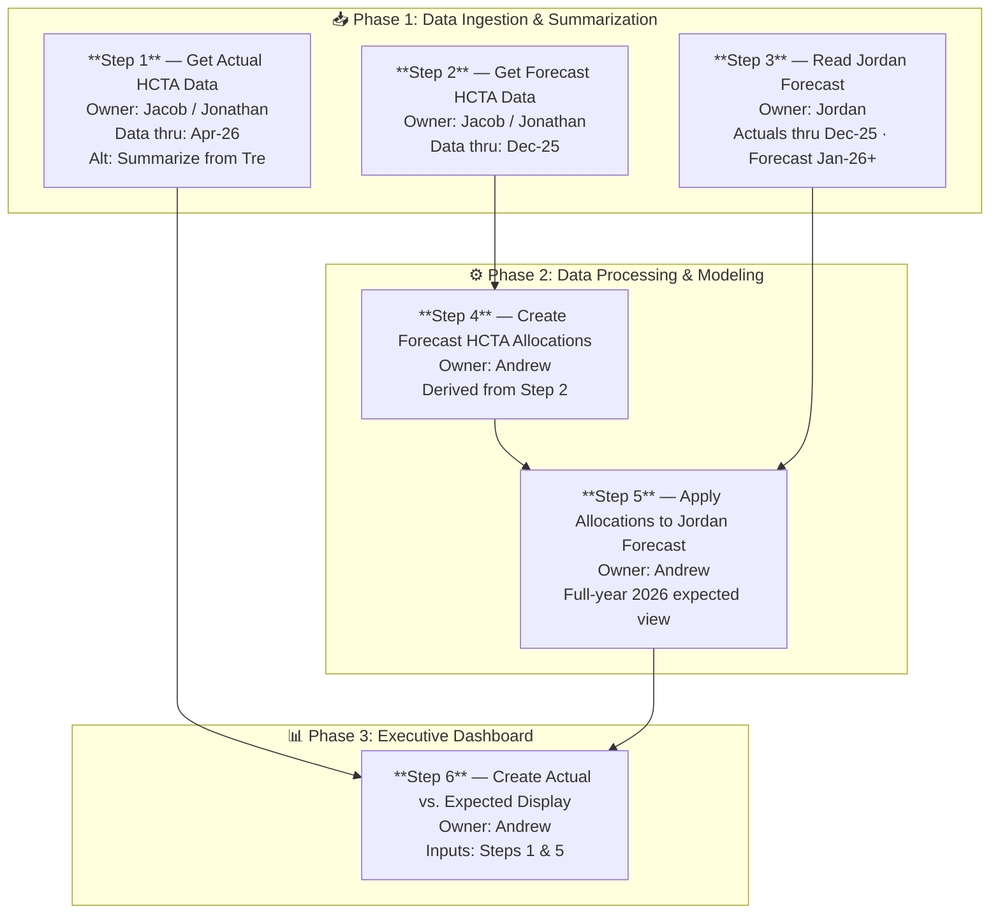

# Actual vs. Expected Medical Expense — Process Flow

The diagram below shows how the six steps relate to each other across the three phases. Steps 1, 2, and 3 can be worked in parallel; Step 4 depends on Step 2; Step 5 converges Steps 3 and 4; and Step 6 is the final join of Steps 1 and 5.

