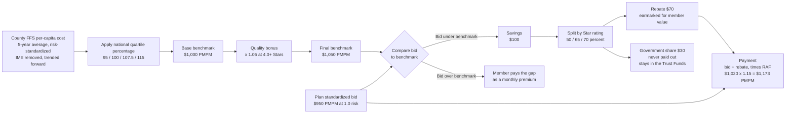
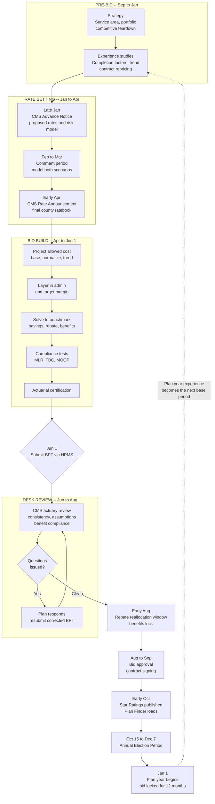

# The Medicare Advantage Actuarial Bid Process

*A working summary of the annual MA bid cycle: timeline, workstreams, deliverables, the CMS back-and-forth, and the analytics underneath it.*

Reference cycle: **CY2027** (bids submitted June 1, 2026). Dates marked *(CY2027 actual)* are confirmed; others are typical patterns that shift by a week or two each year.

---

## 1. The 30-second version

An MA plan's bid is a certified actuarial estimate of what it costs, per member per month, to cover Part A and B benefits for a beneficiary with a risk score of exactly 1.0. CMS compares that bid to a county benchmark it publishes each April. Bidding below the benchmark generates savings, a star-weighted share of which comes back to the plan as a **rebate** that must be spent on member value. The whole thing is submitted through a locked-down Excel workbook called the **Bid Pricing Tool (BPT)**, is signed by a credentialed actuary, and is binding for the full calendar year — there is no mid-year repricing.

The cycle is roughly 15 months long and overlaps itself. While actuaries are defending the CY2027 bid in August 2026, they are already building the CY2028 experience base.

### The core mechanic

---

## 2. The annual calendar

| When | Event | Who acts |
|---|---|---|
| Sep – Dec (prior year) | Strategy setting, market/competitive analysis, benefit ideation, experience studies | Plan |
| Late Jan | **Advance Notice** — CMS's proposed rates, risk model, and payment policy | CMS |
| ~Jan 26, 2026 *(CY2027 actual)* | CY2027 Advance Notice released | CMS |
| Feb – Mar | Industry comment period; plans model the proposed rates | Plan |
| Early Apr | **Rate Announcement** — final county ratebook, growth rate, risk model, normalization | CMS |
| Apr 6, 2026 *(CY2027 actual)* | CY2027 Rate Announcement; net payment change **+2.48%** (~$13B) | CMS |
| Apr – May | Bid build, benefit finalization, pricing iterations, internal/board sign-off | Plan |
| Weekly, spring | **OACT Actuarial User Group calls** — CMS answers technical bid questions | Both |
| First Monday in June | **Bid submission deadline** via HPMS | Plan |
| June 1, 2026 *(CY2027 actual)* | CY2027 bids due | Plan |
| June – Aug | **Desk review** — CMS actuaries issue questions; plans respond and resubmit | Both |
| Early Aug | Rebate reallocation window; final plan/benefit lock | Both |
| Aug 6, 2026 *(CY2027 actual)* | Rebate reallocation deadline | Plan |
| Aug – Sep | Bid approval, contract signing, Summary of Benefits generation | Both |
| Early Oct | **Star Ratings** published; Medicare Plan Finder loads | CMS |
| Oct 15 – Dec 7 | **Annual Election Period (AEP)** | Members |
| Jan 1 | Plan year begins; bid is locked for 12 months | — |

**Key structural point:** the bid is due June 1 for a plan year starting January 1 *nineteen months* after the base experience period typically ends. Actuaries are projecting cost roughly 2.5 years forward. That projection horizon is the single largest source of bid risk.

---

## 3. Phase by phase

### Phase 1 — Pre-bid strategy (Sep – Jan)

Not yet an actuarial exercise, but it constrains everything downstream.

- **Service area decisions.** Which counties to enter, exit, or expand. Benchmark quartile and competitive density drive this.
- **Product portfolio.** How many PBPs (Plan Benefit Packages) per county, and how they're differentiated (HMO/PPO/D-SNP/C-SNP).
- **Competitive teardown.** Scraping prior-year public BPT-derived data, Plan Finder listings, and Summary of Benefits documents to see what competitors offered and at what premium.
- **Experience studies.** Completion factor studies, trend studies, provider contract repricing.

### Phase 2 — Advance Notice → Rate Announcement (Jan – Apr)

CMS publishes proposed payment parameters in late January, takes comment, and finalizes in early April. The gap between the two can move materially, and plans model both.

CY2027 illustrates why this matters. Between the Advance Notice and the final Rate Announcement:

| Component | Advance Notice | Final |
|---|---|---|
| Effective growth rate | +4.97% | +5.33% |
| Risk model revision & normalization | −3.32% | −1.12% |

CMS declined to recalibrate the v28 model on newer FFS data, keeping the existing 2018-diagnosis/2019-expenditure calibration to give the market time to absorb the v28 phase-in. Net expected change landed at **+2.48%** — considerably better than the Advance Notice implied. A plan that priced off the January numbers would have left money on the table.

**What the actuary extracts from the Rate Announcement:**

- The county **ratebook** (benchmark per county, by star tier)
- The **effective growth rate**
- **Risk model** version and coefficients
- **Normalization factors** (rebasing average risk score to 1.0)
- **Coding intensity adjustment** (statutory minimum 5.9%)
- Part D parameters (deductible, catastrophic threshold, direct subsidy)

### Phase 3 — Building the bid (Feb – Jun 1)

The core actuarial workstream. Roughly:

1. **Base period experience.** Usually the prior calendar year, on an incurred basis with completion factors applied. Allowed cost, member months, utilization per 1,000, unit cost — sliced by service category.
2. **Normalize the base.** Strip out one-timers, adjust for risk score drift, restate to a 1.0-risk population, adjust for known network or contract changes.
3. **Trend forward.** Separate utilization and unit-cost trend assumptions by service category, applied across the projection horizon.
4. **Adjust for the plan year.** Benefit design changes, provider contract renegotiations, expected population mix shift, new-to-Medicare vs. switcher mix, program changes (e.g., Part D redesign spillover).
5. **Layer in non-benefit expense.** Administrative cost allocation, broker commissions, quality improvement activity, taxes and fees.
6. **Add target margin.** Typically low single digits, must be defensible and consistent across the portfolio.
7. **Solve to the benchmark.** Compute savings, apply star-based rebate percentage, and allocate the rebate across supplemental benefits, cost-sharing reduction, and premium buydown — usually iterating many times against competitive targets.
8. **Test and certify.** Run compliance tests, then have a qualified actuary sign the certification.

---

## 4. What the output actually looks like

### The Bid Pricing Tool (BPT)

A CMS-issued, macro-locked Excel workbook. **One BPT per plan benefit package per contract** — a mid-size MAO may file dozens; the largest file hundreds. Separate MA and Part D BPTs.

Structurally, the workbook flows (exact worksheet numbering shifts year to year):

| Layer | Contents |
|---|---|
| Base experience | Prior-period allowed costs, member months, utilization by service category |
| Projected allowed cost | Trended, normalized, restated to the plan year at 1.0 risk |
| Plan-level costs | Net of member cost sharing; non-benefit expense; gain/loss margin |
| Standardized bid | The A/B revenue requirement — this is *the bid* |
| Benchmark comparison | Benchmark, savings, rebate calculation |
| Rebate allocation | Dollars mapped to reduced cost sharing, supplemental benefits, Part B/D buydown |
| Part D | Basic and enhanced alternative pricing |
| Summary | Premiums, member cost sharing, projected enrollment |

### Accompanying deliverables

- **Actuarial certification** — signed attestation of ASOP compliance and reasonableness
- **Bid supporting documentation (BSD)** — the narrative and exhibits behind every assumption
- **Plan Benefit Package (PBP)** — the benefit design encoding, filed separately in HPMS
- **Formulary** submission for Part D
- Everything uploaded through **HPMS** by the deadline. Hard cutoff.

---

## 5. The back-and-forth with CMS

This is more collaborative and more iterative than people expect.

### Before submission

CMS's Office of the Actuary (OACT) runs **weekly Actuarial User Group calls** through bid season. Plans submit questions to the `actuarial-bids` mailbox in advance; OACT answers on the call and publishes a running **Actuarial Bid Questions** document. This is the industry's primary channel for resolving technical ambiguity, and the published Q&A is effectively binding guidance for the cycle.

### After submission — desk review (June – August)

Every bid gets reviewed. CMS actuaries examine:

- **Internal consistency** — do the worksheets tie? Does the PBP match the BPT?
- **Assumption reasonableness** — is the trend defensible? Is the margin in line with the plan's other filings and with prior years?
- **Benefit compliance** — cost sharing within limits, MOOP within thresholds, actuarial equivalence to FFS where required
- **Discriminatory design** — benefit structures that would deter high-cost enrollees
- **Year-over-year movement** — unexplained jumps get questioned

CMS issues written questions; the plan's actuary responds, and often resubmits a corrected BPT. Several rounds is normal. Plans that produce clean, well-documented submissions get through faster; plans with a history of aggressive assumptions get harder scrutiny.

CMS also runs a **Bid Improvement Initiative** and, separately, statutorily-required **bid audits** — CMS must annually audit the financial records of a substantial share of MA organizations, so a subset of plans face a much deeper retrospective review than desk review.

### Final windows (early August)

Once benchmarks and rebates are settled, CMS opens a **rebate reallocation** window letting plans shift rebate dollars between uses before benefits lock. For CY2027 this closed **August 6, 2026**, with Part D participation intent due **August 11, 2026**. After that, benefits are frozen and marketing materials are generated.

---

## 6. The analytics underneath

What the actuarial team is actually computing:

**Cost projection**

- Completion factor / IBNR estimation on the base period
- Utilization-per-1,000 and unit-cost decomposition by service category (inpatient, outpatient, professional, SNF, home health, DME, Part B drugs)
- Separate utilization and unit-cost trend models
- Provider contract repricing — modeling renegotiated fee schedules against the base claim set
- Seasonality and induced-demand adjustments for benefit changes

**Risk score projection**

- Prospective RAF modeling under the current HCC model version
- Normalization and coding-intensity impact
- Risk score *drift* — expected change from documentation improvement, attrition, and new-enrollee mix
- v24-to-v28 transition impacts on specific condition cohorts

**Population and enrollment**

- New-to-Medicare vs. switcher mix, and their differing cost curves
- Attrition and disenrollment modeling
- Selection effects from benefit design changes
- Enrollment forecasting by county under competing benefit scenarios

**Benefit and rebate optimization**

- Marginal cost of each supplemental benefit vs. its estimated enrollment lift
- Cost-sharing buydown modeling with induced utilization
- Competitive positioning against modeled competitor offerings
- Sensitivity and scenario analysis across trend, risk score, and star outcomes

**Financial and compliance testing**

- **MLR projection** against the 85% floor
- **Total Beneficiary Cost (TBC)** test — limits year-over-year increases in premium plus cost sharing
- **MOOP** and cost-sharing limit checks
- Actuarial equivalence testing where required
- Margin and contribution-to-surplus by PBP and in aggregate

---

## 7. Constraints worth knowing

| Constraint | Effect |
|---|---|
| **85% MLR floor** | At least 85% of revenue must go to claims and quality improvement; shortfalls trigger remittance, and sustained failure can mean enrollment sanctions or contract termination |
| **TBC test** | Caps how much a plan can degrade benefits year over year — prevents bait-and-switch pricing |
| **MOOP limits** | CMS sets mandatory and voluntary out-of-pocket maximum thresholds |
| **Rebate earmarking** | Rebate dollars cannot flow to margin; they must fund member value (though admin and margin *on delivering* supplemental benefits is allocable) |
| **Annual lock** | No mid-year repricing. A bad trend assumption is absorbed for 12 months |
| **Star lag** | Payment-year stars reflect performance from two years prior — quality work has a long payback |

---

## 8. Where the leverage is

Three levers move MA economics, and they operate on different time horizons:

1. **Star ratings** — two-year lag, affects both the benchmark (+5% at 4.0+) and the rebate share (50% / 65% / 70%). Slowest lever, largest compounding effect.
2. **Risk score accuracy** — one-year lag, scales every dollar of payment. Increasingly scrutinized via RADV audits and the chart-review policy debate.
3. **Bid precision** — immediate. The difference between a good and a mediocre bid is often a few dollars PMPM of trend assumption, which at scale is enormous, and which is unrecoverable once the year starts.

---

## Glossary

| Term | Meaning |
|---|---|
| **BPT** | Bid Pricing Tool — the CMS Excel workbook the bid is filed in |
| **PBP** | Plan Benefit Package — one distinct product; each files its own bid |
| **HPMS** | Health Plan Management System — CMS's submission portal |
| **OACT** | CMS Office of the Actuary |
| **RAF** | Risk Adjustment Factor — a beneficiary's risk score |
| **HCC** | Hierarchical Condition Category — the risk model's condition groupings |
| **MOOP** | Maximum Out-of-Pocket |
| **TBC** | Total Beneficiary Cost test |
| **MLR** | Medical Loss Ratio |
| **QBP** | Quality Bonus Payment — the star-driven benchmark increase |
| **USPCC** | US Per Capita Cost — the national FFS spending basis for growth rates |
| **AEP** | Annual Election Period, Oct 15 – Dec 7 |

---

## Sources

- [CY2027 Medicare Advantage & Part D Rate Announcement fact sheet — CMS](https://www.cms.gov/newsroom/fact-sheets/2027-medicare-advantage-part-d-rate-announcement)
- [CY2027 Announcement (full document, PDF) — CMS](https://www.cms.gov/files/document/2027-announcement.pdf)
- [2027 Medicare Advantage and Part D Advance Notice — CMS](https://www.cms.gov/newsroom/fact-sheets/2027-medicare-advantage-part-d-advance-notice)
- [Actuarial Bid Training — CMS](https://www.cms.gov/medicare/payment/medicare-advantage-rates-statistics/actuarial-bid-training)
- [Actuarial Bid Questions — CMS](https://www.cms.gov/medicare/payment/medicare-advantage-rates-statistics/actuarial-bid-questions)
- [CY2027 Actuarial Bid Call Weekly Announcements (PDF) — CMS](https://www.cms.gov/files/document/cy-2027-actuarial-bid-call-weekly-announcements.pdf-0)
- [July 28, 2026 Parts C & D Announcement (PDF) — CMS](https://www.cms.gov/files/document/july-28-2026-parts-c-d-announcement.pdf)
- [MA Bid Pricing Tool Instructions (PDF) — CMS](https://www.cms.gov/files/document/cy2025-ma-bpt-instructions20240405.pdf)
- [Bid Forms & Instructions, 2026 — CMS](https://www.cms.gov/medicare/payment/medicare-advantage-rates-statistics/bid-forms-instructions/2026)
- [CMS Finalizes CY 2027 Medicare Advantage and Part D Rule — Holland & Knight](https://www.hklaw.com/en/insights/publications/2026/04/cms-finalizes-cy-2027-medicare-advantage-and-part-d-rule)
- [From "Flat" to Favorable: CY2027 Rate Announcement — Georgetown Medicare Policy Initiative](https://medicare.chir.georgetown.edu/from-flat-to-favorable-how-medicare-advantage-payments-increased-in-the-calendar-year-cy-2027-rate-announcement/)
- [CMS' CY2027 MA Advance Rate Notice: Breaking Down Its Components — American Action Forum](https://www.americanactionforum.org/insight/cms-cy2027-ma-advance-rate-notice-breaking-down-its-components/)
