# PI_Dups Databricks CI/CD Deployment Explained

## Executive Summary

The inspected project is not a self-contained, deployable repository. `PI_Dups` is a top-level folder in `swanrvr19/Adhoc_Projects`, inspected at commit `b32e484a5573a9059d13de90ab39a9e2facb9440` on 2026-09-12. Its one-line readme contains only `x`, so it does not document deployment ([`PI_Dups/ReadMe.txt:1`](https://github.com/swanrvr19/Adhoc_Projects/blob/b32e484a5573a9059d13de90ab39a9e2facb9440/PI_Dups/ReadMe.txt#L1)).

The strongest conclusion is that `PI_Dups` is a snapshot of part of a different, live repository:

- There is no repository-root `.github/workflows/` directory in `Adhoc_Projects`, and the apparent workflow files are instead stored under `PI_Dups/workflows/`. GitHub only discovers workflow files in the root `.github/workflows` directory, so these copies do not run in `Adhoc_Projects`. The copies themselves refer to their expected live locations as `.github/workflows/...` ([`validate-bundle.yml:11–15`](https://github.com/swanrvr19/Adhoc_Projects/blob/b32e484a5573a9059d13de90ab39a9e2facb9440/PI_Dups/workflows/validate-bundle.yml#L11-L15)); see also [GitHub's workflow-discovery documentation](https://docs.github.com/en/actions/concepts/workflows-and-actions/workflows).
- No `databricks.yml`/`databricks.yaml`, Python build metadata, dependency lock file, tests, `shared/` package, or deployment script exists inside `PI_Dups`. In particular, the bundle root, effective build configuration, and shared runtime modules are needed to reproduce the apparent deployment; the other missing files are needed to explain the copied CI checks completely.
- A sibling runbook describes the expected live repository as `pi-slg`, with top-level `dups/`, `shared/`, `tests/`, `.github/workflows/`, and `pyproject.toml` ([`PI_SLG_Directions.md:20–46`](https://github.com/swanrvr19/Adhoc_Projects/blob/b32e484a5573a9059d13de90ab39a9e2facb9440/PI_SLG/PI_SLG_Directions.md#L20-L46)). It identifies the internal repository as `AIDE_0088396/pi-slg` in Immerse ([`PI_SLG_Directions.md:199–208`](https://github.com/swanrvr19/Adhoc_Projects/blob/b32e484a5573a9059d13de90ab39a9e2facb9440/PI_SLG/PI_SLG_Directions.md#L199-L208)). This is a well-supported lead, but the live repository was not available during this inspection.

If the copied YAML accurately reflects the live `pi-slg` workflow, the intended deployment is:

1. A pull request into `main` is merged, or a person manually dispatches the deployment workflow.
2. A self-hosted `uhg-runner` checks out the live repository's current `main` branch.
3. It prepares Python 3.12, installs Hatchling, installs the Databricks CLI, and authenticates to one hard-coded Azure Databricks workspace with an Azure service principal.
4. It runs `databricks bundle validate -t prod` and then `databricks bundle deploy -t prod` ([`deploy-jobs.yml:29–55`](https://github.com/swanrvr19/Adhoc_Projects/blob/b32e484a5573a9059d13de90ab39a9e2facb9440/PI_Dups/workflows/deploy-jobs.yml#L29-L55)).
5. The bundle should create or update the two visible `PI_Dups` jobs—**Dup Denials - Full** and **Dup Denials - Intramonth**—and may reconcile other resources defined only in the unavailable live bundle.
6. No explicit post-deployment job run is visible. The copied workflow ends after `bundle deploy`; it contains no `databricks bundle run` or Jobs API `run-now` command. The unavailable live bundle/build configuration must still be checked for deploy-time hooks or other side effects.

There is one direct mismatch with the stated requirement: the copied deployment workflow has no `push:` event. It deploys after a merged PR, not after a direct push to `main` ([`deploy-jobs.yml:3–9`](https://github.com/swanrvr19/Adhoc_Projects/blob/b32e484a5573a9059d13de90ab39a9e2facb9440/PI_Dups/workflows/deploy-jobs.yml#L3-L9)). The live workflow must be inspected before deciding whether that mismatch also exists there.

> **Confidence labels used below:** **Confirmed** means directly supported by current `PI_Dups` files. **Conditional** means supported by a copied workflow but still needs confirmation in `pi-slg`. **Unavailable** means the necessary file, setting, log, or access was not present.

## End-to-End Deployment Flow

```mermaid
flowchart LR
    S["Adhoc_Projects/PI_Dups<br/>snapshot inspected"]
    R["Live pi-slg repo<br/>likely, but unavailable"]
    PR["PR merged into main"]
    GA["GitHub Actions<br/>deploy workflow"]
    PREP["Checkout main<br/>Python + Hatchling + CLI"]
    AUTH["Azure service-principal auth"]
    VAL["bundle validate -t prod"]
    DEP["bundle deploy -t prod"]
    DBX["Azure Databricks workspace<br/>adb-3239959380256842..."]
    JOBS["Create/update 2 visible DUPS jobs<br/>plus any unseen bundle resources<br/>no explicit run step"]
    PUSH["Direct push to main"]

    S -. "unavailable sync/dispatch mechanism" .-> R
    R --> PR --> GA --> PREP --> AUTH --> VAL --> DEP --> DBX --> JOBS
    PUSH -. "not a trigger in copied workflow" .-> GA
```



The solid path after `pi-slg` is **conditional** on the live files matching the copies. The dotted connection from the snapshot is deliberately marked unavailable: no `repository_dispatch`, `workflow_call`, cross-repository checkout, webhook, mirroring script, or other handoff is visible in `PI_Dups`.

## Trigger: What Starts the Deployment

The copied deploy workflow declares two triggers ([`deploy-jobs.yml:3–9`](https://github.com/swanrvr19/Adhoc_Projects/blob/b32e484a5573a9059d13de90ab39a9e2facb9440/PI_Dups/workflows/deploy-jobs.yml#L3-L9)):

- `workflow_dispatch`: a manual run from GitHub Actions.
- `pull_request` with type `closed`, limited to pull requests whose base branch is `main`.

Closing a pull request does not always mean merging it, so the job has an additional guard: it runs only for a manual dispatch or when `github.event.pull_request.merged == true` ([`deploy-jobs.yml:16–19`](https://github.com/swanrvr19/Adhoc_Projects/blob/b32e484a5573a9059d13de90ab39a9e2facb9440/PI_Dups/workflows/deploy-jobs.yml#L16-L19)). This is the standard GitHub pattern for a post-merge workflow; see [GitHub's merged-pull-request example](https://docs.github.com/en/actions/reference/workflows-and-actions/events-that-trigger-workflows#running-your-pull_request-workflow-when-a-pull-request-merges).

What the copied workflow does **not** contain is equally important:

- No `push` trigger exists, so a direct push to `main` does not start it.
- No path filter exists on deployment, so every merged PR into `main` would attempt a bundle deployment, even a documentation-only change.
- No `concurrency` group serializes production deployments. Two closely timed merges could start overlapping deployments.
- Checkout forces `ref: main` ([`deploy-jobs.yml:29–32`](https://github.com/swanrvr19/Adhoc_Projects/blob/b32e484a5573a9059d13de90ab39a9e2facb9440/PI_Dups/workflows/deploy-jobs.yml#L29-L32)). That gets the merged branch, but it also means a delayed run can deploy a newer `main` commit than the merge that originally triggered it.

The PR bundle-validation copy has a different trigger. It runs on opened, updated (`synchronize`), or reopened PRs into `main`, and only when a listed workflow file, `databricks.yml`, or a `**/jobs/*.yml` file changes ([`validate-bundle.yml:3–15`](https://github.com/swanrvr19/Adhoc_Projects/blob/b32e484a5573a9059d13de90ab39a9e2facb9440/PI_Dups/workflows/validate-bundle.yml#L3-L15)). Runtime `.py` files, `pyproject.toml`, and lock files are not in that path filter.

## GitHub Actions Workflow Explained

The files below are **workflow copies**, not active workflows in `Adhoc_Projects`:

| Copied file | Apparent purpose | Event | Result |
|---|---|---|---|
| `PI_Dups/workflows/lint.yml` | General CI | Manual, or PR opened/updated/reopened | Six code-quality/test jobs |
| `PI_Dups/workflows/validate-bundle.yml` | Bundle CI | Selected changes in a PR to `main` | Validates only; no deployment |
| `PI_Dups/workflows/deploy-jobs.yml` | CD | Manual, or merged PR to `main` | Validates and deploys target `prod` |

### Deployment job, step by step

Before its jobs start, the workflow sets three package-management variables ([`deploy-jobs.yml:11–14`](https://github.com/swanrvr19/Adhoc_Projects/blob/b32e484a5573a9059d13de90ab39a9e2facb9440/PI_Dups/workflows/deploy-jobs.yml#L11-L14)). `PIP_NO_INPUT=1` suppresses interactive pip prompts. `PIP_UPLOADED_PRIOR_TO=P30D` and `UV_EXCLUDE_NEWER=P30D` appear intended to restrict very recently uploaded packages; their exact effect depends on the live installer/tool configuration. They are package-resolution controls, not Databricks environment or bundle-target selectors.

1. **Choose the runner and permissions.** The job requests the custom `uhg-runner` label and gives `GITHUB_TOKEN` read-only repository-content permission ([`deploy-jobs.yml:17–21`](https://github.com/swanrvr19/Adhoc_Projects/blob/b32e484a5573a9059d13de90ab39a9e2facb9440/PI_Dups/workflows/deploy-jobs.yml#L17-L21)). The live GitHub organization must supply an online runner with that label and network access to GitHub Actions, internal JFrog, Azure identity endpoints, and Databricks.

2. **Check out `main`.** `actions/checkout@v6` downloads the repository that owns the workflow and explicitly selects `main` ([`deploy-jobs.yml:29–32`](https://github.com/swanrvr19/Adhoc_Projects/blob/b32e484a5573a9059d13de90ab39a9e2facb9440/PI_Dups/workflows/deploy-jobs.yml#L29-L32)). There is no `repository:` input, so this step does not fetch `swanrvr19/Adhoc_Projects` or `PI_Dups` from somewhere else.

3. **Prepare Python.** `actions/setup-python@v6` selects Python 3.12. That step receives `PIP_INDEX_URL` and `PIP_EXTRA_INDEX_URL` values containing the `JFROG_User` and `JFROG_Token` secrets; the workflow repeats the same step-scoped values on the following pip install ([`deploy-jobs.yml:34–46`](https://github.com/swanrvr19/Adhoc_Projects/blob/b32e484a5573a9059d13de90ab39a9e2facb9440/PI_Dups/workflows/deploy-jobs.yml#L34-L46)).

4. **Install the build backend.** `pip install hatchling` installs Hatchling from those indexes ([`deploy-jobs.yml:42–46`](https://github.com/swanrvr19/Adhoc_Projects/blob/b32e484a5573a9059d13de90ab39a9e2facb9440/PI_Dups/workflows/deploy-jobs.yml#L42-L46)). It does not itself build the project. If the live bundle resembles the sibling bundle example, its artifact definition invokes the actual wheel build during deployment; the authoritative build step is unavailable. The JFrog index variables are step-scoped and are not set on the later deploy step, so a live artifact build that downloads dependencies may lack those credentials.

5. **Install the Databricks CLI.** `databricks/setup-cli` is pinned to a full action commit annotated `#v1.5.0` ([`deploy-jobs.yml:48–49`](https://github.com/swanrvr19/Adhoc_Projects/blob/b32e484a5573a9059d13de90ab39a9e2facb9440/PI_Dups/workflows/deploy-jobs.yml#L48-L49)). With no version input, that action's release setup reads its checked-in `VERSION` file ([pinned `setup_release.sh:5–9`](https://github.com/databricks/setup-cli/blob/f01853f8d6b12678ab0fab76ffad726c460be1a5/setup_release.sh#L5-L9)), and the same commit carries version 1.5.0 ([pinned `VERSION`](https://github.com/databricks/setup-cli/blob/f01853f8d6b12678ab0fab76ffad726c460be1a5/VERSION)). This therefore pins both the action source and Databricks CLI 1.5.0.

6. **Validate.** `databricks bundle validate -t prod` asks the CLI to find the bundle root, select the target named `prod`, resolve included configuration and variables, authenticate as needed, and check the bundle configuration without deploying it ([`deploy-jobs.yml:51–52`](https://github.com/swanrvr19/Adhoc_Projects/blob/b32e484a5573a9059d13de90ab39a9e2facb9440/PI_Dups/workflows/deploy-jobs.yml#L51-L52)). Officially, `-t` is short for `--target`, and successful validation prints the resolved bundle identity; see the [Databricks bundle command reference](https://docs.databricks.com/aws/en/dev-tools/cli/bundle-commands#databricks-bundle-validate).

7. **Deploy.** `databricks bundle deploy -t prod` builds configured artifacts, uploads/synchronizes configured files, and reconciles bundle-managed resources in the selected workspace ([`deploy-jobs.yml:54–55`](https://github.com/swanrvr19/Adhoc_Projects/blob/b32e484a5573a9059d13de90ab39a9e2facb9440/PI_Dups/workflows/deploy-jobs.yml#L54-L55)). Exactly what it builds and synchronizes is unavailable because the live bundle root is missing.

### Pull-request bundle-validation job

The separate validation copy is much shorter: its one job selects `uhg-runner`, exposes the same Databricks authentication variables, checks out the pull-request revision, installs the pinned CLI, and runs only `databricks bundle validate -t prod` ([`validate-bundle.yml:17–36`](https://github.com/swanrvr19/Adhoc_Projects/blob/b32e484a5573a9059d13de90ab39a9e2facb9440/PI_Dups/workflows/validate-bundle.yml#L17-L36)). It has no Python setup, test, wheel-build, or deploy step. The lint workflow supplies separate code-quality/test activities.

### CI jobs in the lint copy

The lint copy defines six independent jobs:

- Embedded SQL checks for tracked Python files and notebooks ([`lint.yml:13–57`](https://github.com/swanrvr19/Adhoc_Projects/blob/b32e484a5573a9059d13de90ab39a9e2facb9440/PI_Dups/workflows/lint.yml#L13-L57)).
- Ruff lint ([`lint.yml:59–83`](https://github.com/swanrvr19/Adhoc_Projects/blob/b32e484a5573a9059d13de90ab39a9e2facb9440/PI_Dups/workflows/lint.yml#L59-L83)).
- Ruff formatting verification ([`lint.yml:85–127`](https://github.com/swanrvr19/Adhoc_Projects/blob/b32e484a5573a9059d13de90ab39a9e2facb9440/PI_Dups/workflows/lint.yml#L85-L127)).
- Pylint with the Databricks Labs plugin ([`lint.yml:129–169`](https://github.com/swanrvr19/Adhoc_Projects/blob/b32e484a5573a9059d13de90ab39a9e2facb9440/PI_Dups/workflows/lint.yml#L129-L169)).
- `ty` type checking ([`lint.yml:171–200`](https://github.com/swanrvr19/Adhoc_Projects/blob/b32e484a5573a9059d13de90ab39a9e2facb9440/PI_Dups/workflows/lint.yml#L171-L200)).
- Pytest ([`lint.yml:202–231`](https://github.com/swanrvr19/Adhoc_Projects/blob/b32e484a5573a9059d13de90ab39a9e2facb9440/PI_Dups/workflows/lint.yml#L202-L231)).

These jobs expect `uv sync --dev` and project-defined development dependencies, but the corresponding `pyproject.toml`, lock file, and tests are not present in `PI_Dups`. Also, the deploy workflow does not declare `needs:` on these checks. Whether they must pass before merge depends on unavailable branch-protection settings in the live repository.

In plain English, the important CI commands mean:

| Command | What it does |
|---|---|
| `python -m pip install --upgrade pip uv` | Updates Python's package installer and installs the `uv` environment/package tool. |
| `uv sync --dev` | Recreates or synchronizes the project environment from the unavailable project metadata, including development tools. |
| `uv run embedded-sql --check --diff ...` | Checks SQL embedded in source files and shows formatting differences without intentionally rewriting them. |
| `uv run ruff check` | Runs Ruff's Python lint rules. |
| `uv run ruff format --check --diff` | Checks formatting and prints differences; it is a verification command rather than a formatting commit. |
| `uv run pylint ...` | Runs deeper static analysis, including the Databricks Labs plugin. |
| `uv run ty check .` | Type-checks the repository. |
| `uv run pytest` | Runs the project's test suite. |

The precise CI-tool versions and rules come from the unavailable project/lock configuration, so they cannot be reconstructed from these workflow copies alone.

## Databricks Authentication

The copied validation and deployment jobs configure Microsoft Entra/Azure service-principal client-secret authentication, not a Databricks personal access token and not GitHub OIDC ([`deploy-jobs.yml:22–27`](https://github.com/swanrvr19/Adhoc_Projects/blob/b32e484a5573a9059d13de90ab39a9e2facb9440/PI_Dups/workflows/deploy-jobs.yml#L22-L27); [`validate-bundle.yml:22–27`](https://github.com/swanrvr19/Adhoc_Projects/blob/b32e484a5573a9059d13de90ab39a9e2facb9440/PI_Dups/workflows/validate-bundle.yml#L22-L27)):

| Runner environment variable | Value source | Meaning |
|---|---|---|
| `DATABRICKS_AUTH_TYPE` | Literal `azure-client-secret` | Forces the Azure client-secret authentication method |
| `DATABRICKS_HOST` | Hard-coded URL | Workspace endpoint |
| `ARM_CLIENT_ID` | `secrets.DATABRICKS_CLIENT_ID` | Entra application/client ID |
| `ARM_CLIENT_SECRET` | `secrets.DATABRICKS_CLIENT_SECRET` | Entra client secret |
| `ARM_TENANT_ID` | `secrets.DATABRICKS_TENANT_ID` | Entra tenant ID |

The visible host is `https://adb-3239959380256842.2.azuredatabricks.net/`. The project directions identify the same URL as the team's Databricks workspace ([`PI_SLG_Directions.md:90–105`](https://github.com/swanrvr19/Adhoc_Projects/blob/b32e484a5573a9059d13de90ab39a9e2facb9440/PI_SLG/PI_SLG_Directions.md#L90-L105)). The string `prod` is only a bundle target name; neither the URL nor the copied workflow alone proves the organization's formal environment classification.

Current Azure Databricks authentication documentation recognizes `ARM_CLIENT_ID`, `ARM_CLIENT_SECRET`, and `ARM_TENANT_ID` for Microsoft Entra service-principal authentication ([official environment-variable reference](https://learn.microsoft.com/en-us/azure/databricks/dev-tools/auth/env-vars)). Successful authentication still depends on secret presence and freshness, the correct tenant/client pairing, workspace assignment, entitlements, and permissions; none of those values or settings is visible here.

Deployment identity and runtime identity must not be confused:

- The GitHub `ARM_*` credentials let the CLI validate and deploy.
- No visible `run_as` setting establishes which principal executes the deployed jobs. That may be defined in the missing bundle target, or Databricks may use the deployed job's owner according to the effective configuration.
- At runtime, `dups.util.connection` separately asks the unavailable `shared.databricks_env.get_secret` helper for a credential identified as `snowflaketoken` ([`connection.py:1–16`](https://github.com/swanrvr19/Adhoc_Projects/blob/b32e484a5573a9059d13de90ab39a9e2facb9440/PI_Dups/dups/util/connection.py#L1-L16)). The backing secret store and scope are unknown, and the GitHub deployment secret does not supply this Snowflake credential.

## Databricks Bundle and Job Configuration

### Missing bundle root

There is no authoritative `databricks.yml` or `databricks.yaml` in `PI_Dups`. This prevents confirmation of:

- Bundle name and deployment identity.
- Included resource files.
- Artifact and wheel build commands.
- File synchronization rules and `.gitignore` effects.
- `prod` target host, root/state paths, mode, presets, variables, and overrides.
- Job `run_as` identity and top-level permissions.

A sibling scratch/reference file provides a plausible older shape: bundle `pi-slg-jobs`, include glob `**/jobs/*.yml`, a wheel build using `pip wheel . --no-deps --no-build-isolation -w dist`, and one production target using the same host ([`Misc_Files/databricks.yaml:1–19`](https://github.com/swanrvr19/Adhoc_Projects/blob/b32e484a5573a9059d13de90ab39a9e2facb9440/Misc_Files/databricks.yaml#L1-L19)). It is **not** the live source of truth: it is not at the repository or `PI_Dups` root where the copied workflow runs its commands, is named for `pi-slg`, and does not define variables required by the current job files. Databricks resolves `include` globs relative to the bundle configuration and determines uploaded files from bundle synchronization rules, whether default or explicitly configured; see the [official bundle configuration reference](https://docs.databricks.com/aws/en/dev-tools/bundles/reference#include).

In that non-authoritative example, the build command means:

- `pip wheel .`: build the Python project in the current directory into a wheel archive.
- `--no-deps`: do not download or build the project's runtime dependencies as separate wheels.
- `--no-build-isolation`: reuse the runner's prepared Python environment—where Hatchling was installed—instead of creating an isolated build environment.
- `-w dist`: place the resulting wheel in the `dist/` directory.

The missing live `pyproject.toml` is still needed to know which packages enter that wheel and whether this is the current build command.

### Two current job resources

The current files declare two logical resources:

- `Dup_Denials_Full`, displayed as **Dup Denials - Full** ([`dup_denials_full.job.yml:2–5`](https://github.com/swanrvr19/Adhoc_Projects/blob/b32e484a5573a9059d13de90ab39a9e2facb9440/PI_Dups/dups/jobs/dup_denials_full.job.yml#L2-L5)).
- `Dup_Denials_Intramonth`, displayed as **Dup Denials - Intramonth** ([`dup_denials_intramonth.job.yml:2–5`](https://github.com/swanrvr19/Adhoc_Projects/blob/b32e484a5573a9059d13de90ab39a9e2facb9440/PI_Dups/dups/jobs/dup_denials_intramonth.job.yml#L2-L5)).

Both grant `CAN_MANAGE_RUN` to the workspace group `AZU_UDLP_ota_payment_int_DataEngineer` ([full job:6–8](https://github.com/swanrvr19/Adhoc_Projects/blob/b32e484a5573a9059d13de90ab39a9e2facb9440/PI_Dups/dups/jobs/dup_denials_full.job.yml#L6-L8)). The group must exist, and the deployer must be allowed to set that ACL.

Their schedules are:

- Full: `44 0 22 4 * ?` in `America/Chicago`, meaning 10:00:44 PM on the fourth day of each month ([full job:9–12](https://github.com/swanrvr19/Adhoc_Projects/blob/b32e484a5573a9059d13de90ab39a9e2facb9440/PI_Dups/dups/jobs/dup_denials_full.job.yml#L9-L12)).
- Intramonth: `44 0 10 ? * Mon` in `America/Chicago`, meaning 10:00:44 AM each Monday ([intramonth job:9–12](https://github.com/swanrvr19/Adhoc_Projects/blob/b32e484a5573a9059d13de90ab39a9e2facb9440/PI_Dups/dups/jobs/dup_denials_intramonth.job.yml#L9-L12)).

Neither current resource explicitly sets `pause_status`. The Databricks Jobs API default is `UNPAUSED`, so a newly created job should run at its cron time unless the missing target/effective configuration overrides it ([Jobs API schedule reference](https://docs.databricks.com/api/jobs/v2/reset-job)). Because the live target and deployed job JSON are unavailable, the effective state must still be verified.

Both jobs use a job-scoped cluster with Databricks Runtime `17.3.x-scala2.13`, `Standard_E16d_v4` driver and workers, `SINGLE_USER` data security mode, the standard runtime engine, on-demand Azure instances, and two workers ([full job:15–27](https://github.com/swanrvr19/Adhoc_Projects/blob/b32e484a5573a9059d13de90ab39a9e2facb9440/PI_Dups/dups/jobs/dup_denials_full.job.yml#L15-L27)).

Both current jobs are strictly sequential:

```text
CIRRUS -> COSMOS -> CSP -> UNET -> Generate_CSVs
```

The dependencies are explicit in each file ([full job:28–66](https://github.com/swanrvr19/Adhoc_Projects/blob/b32e484a5573a9059d13de90ab39a9e2facb9440/PI_Dups/dups/jobs/dup_denials_full.job.yml#L28-L66); [intramonth job:28–66](https://github.com/swanrvr19/Adhoc_Projects/blob/b32e484a5573a9059d13de90ab39a9e2facb9440/PI_Dups/dups/jobs/dup_denials_intramonth.job.yml#L28-L66)). An older file under `Misc_Files` shows a materially different parallel/fan-in design, Photon autoscaling, and explicit wheel paths ([`databricks_dup_denials_job.yaml:18–77`](https://github.com/swanrvr19/Adhoc_Projects/blob/b32e484a5573a9059d13de90ab39a9e2facb9440/Misc_Files/databricks_dup_denials_job.yaml#L18-L77)); it should not be used to explain the current job graph.

Each current task gets its libraries from `${var.job_libraries}`, and each job gets its email configuration from `${var.dups_email_notifications}` ([full job:12–66](https://github.com/swanrvr19/Adhoc_Projects/blob/b32e484a5573a9059d13de90ab39a9e2facb9440/PI_Dups/dups/jobs/dup_denials_full.job.yml#L12-L66)). Neither variable is defined in this repository snapshot. The missing live bundle must declare and correctly type them.

Job-level parameters include `min_proc_dt`, `note`, `run_type`, `test_name`, and `deployment_target`; the last is set to `${bundle.target}` ([full job:71–81](https://github.com/swanrvr19/Adhoc_Projects/blob/b32e484a5573a9059d13de90ab39a9e2facb9440/PI_Dups/dups/jobs/dup_denials_full.job.yml#L71-L81)). The intramonth job differs by defaulting `run_type` to `intramonth` ([intramonth job:71–81](https://github.com/swanrvr19/Adhoc_Projects/blob/b32e484a5573a9059d13de90ab39a9e2facb9440/PI_Dups/dups/jobs/dup_denials_intramonth.job.yml#L71-L81)).

Both definitions enable Databricks job queueing ([full job:67–70](https://github.com/swanrvr19/Adhoc_Projects/blob/b32e484a5573a9059d13de90ab39a9e2facb9440/PI_Dups/dups/jobs/dup_denials_full.job.yml#L67-L70)). That is runtime behavior after a job is triggered; it is not a deployment queue and does not serialize competing GitHub deployment runs.

## What Gets Deployed

**Confirmed desired resources:** two Databricks job definitions, each pointing to five source-format workspace notebooks and a shared job cluster.

**Conditionally expected bundle content:** if the live bundle really uses `include: "**/jobs/*.yml"`, both job YAMLs will be merged into the bundle. If its artifact block resembles the sibling reference, it will build a Python wheel from the live repository. The current task library variable must then attach that wheel and any required shared libraries.

The referenced task code exists in the snapshot:

- Four product notebooks: CIRRUS, COSMOS, CSP, and UNET. They are Databricks source notebooks, import `dups` and an unavailable `shared` package, and read Spark/Databricks services—for example, CIRRUS initializes the common environment and parameters at [`cirrus_dup_denials.py:1–45`](https://github.com/swanrvr19/Adhoc_Projects/blob/b32e484a5573a9059d13de90ab39a9e2facb9440/PI_Dups/dups/product/cirrus_dup_denials.py#L1-L45).
- The notebooks read source tables under `ota_payment_int.pi_sources`; that catalog/schema mapping is hard-coded in [`table_config.py:9–35`](https://github.com/swanrvr19/Adhoc_Projects/blob/b32e484a5573a9059d13de90ab39a9e2facb9440/PI_Dups/dups/util/table_config.py#L9-L35).
- They query Snowflake through `dups.util.connection`, which supplies database, schema, warehouse, role, and a private-key credential retrieved under the name `snowflaketoken` to the Spark Snowflake connector ([`connection.py:5–85`](https://github.com/swanrvr19/Adhoc_Projects/blob/b32e484a5573a9059d13de90ab39a9e2facb9440/PI_Dups/dups/util/connection.py#L5-L85)).
- Each product notebook overwrites its output table with schema overwrite—for example, CIRRUS at [`cirrus_dup_denials.py:374–410`](https://github.com/swanrvr19/Adhoc_Projects/blob/b32e484a5573a9059d13de90ab39a9e2facb9440/PI_Dups/dups/product/cirrus_dup_denials.py#L374-L410), COSMOS at [`cosmos_dup_denials.py:444–478`](https://github.com/swanrvr19/Adhoc_Projects/blob/b32e484a5573a9059d13de90ab39a9e2facb9440/PI_Dups/dups/product/cosmos_dup_denials.py#L444-L478), CSP at [`csp_dup_denials.py:574–616`](https://github.com/swanrvr19/Adhoc_Projects/blob/b32e484a5573a9059d13de90ab39a9e2facb9440/PI_Dups/dups/product/csp_dup_denials.py#L574-L616), and UNET at [`unet_dup_denials.py:402–424`](https://github.com/swanrvr19/Adhoc_Projects/blob/b32e484a5573a9059d13de90ab39a9e2facb9440/PI_Dups/dups/product/unet_dup_denials.py#L402-L424).
- The final CSV task reads all four result tables, calls unavailable `shared.export` helpers, creates compressed dataset names, and writes a trigger file ([`generate_csvs.py:1–22`](https://github.com/swanrvr19/Adhoc_Projects/blob/b32e484a5573a9059d13de90ab39a9e2facb9440/PI_Dups/dups/export/generate_csvs.py#L1-L22)). The actual export destination and credentials cannot be traced without `shared/export.py`.

Output routing depends on the job parameters. Only `deployment_target == "prod"` with an empty `test_name` writes to `ota_payment_int.pi_results`; other combinations write to `pi_dev`, while intramonth and test runs add suffixes ([`table_config.py:38–70`](https://github.com/swanrvr19/Adhoc_Projects/blob/b32e484a5573a9059d13de90ab39a9e2facb9440/PI_Dups/dups/util/table_config.py#L38-L70)). Correct propagation of `${bundle.target}` is therefore operationally important.

`generate_excel.py` exists and can write an Excel workbook beneath `/Workspace/Shared/Dup Denials/output` ([`generate_excel.py:28–56`](https://github.com/swanrvr19/Adhoc_Projects/blob/b32e484a5573a9059d13de90ab39a9e2facb9440/PI_Dups/dups/export/generate_excel.py#L28-L56)), but neither job references it. It is not part of the visible execution graph; missing sync rules determine whether it is merely uploaded.

Nothing visible declares or deploys the Unity Catalog source tables, the Snowflake credential, the destination used by `shared.export`, or the Azure infrastructure. Those are external prerequisites, not bundle resources proven by this snapshot.

## How the Databricks Job Is Created or Updated

The YAML keys `Dup_Denials_Full` and `Dup_Denials_Intramonth` are logical bundle resource keys. When the CLI deploys a complete bundle for the first time, it creates remote resources that do not yet exist. On later deployments with the same bundle identity and state, it updates the resources by tracked ID rather than matching only on display name. Databricks documents that identity and reconciliation behavior in the [`bundle deploy` reference](https://docs.databricks.com/aws/en/dev-tools/cli/bundle-commands#bundle-target-and-identity).

That leads to several important caveats:

- The actual bundle name, target, deployment root/state path, and deployment identity are unavailable. Those determine whether the CLI recognizes a prior deployment.
- A manually created job with the same display name is not necessarily adopted. The live repository would need an existing deployment state or an explicit `databricks bundle deployment bind` operation; no binding is visible here.
- If the bundle identity, workspace, root path, or service-principal identity changes, the deployment could be treated as a different bundle and create duplicates rather than update the intended jobs.
- The command has no `--select`, so it reconciles the complete resolved bundle, not only the two DUPS jobs. A resource removed from that resolved configuration can be deleted if this bundle previously deployed it ([official `bundle deploy` behavior](https://docs.databricks.com/aws/en/dev-tools/cli/bundle-commands#bundle-target-and-identity)).
- The command also has no `--auto-approve`. If the CLI requires approval for a deployment change, the noninteractive Actions run can stop or fail instead of silently approving it.

After the deploy command, the shown workflow stops. It never calls `databricks bundle run -t prod Dup_Denials_Full`, `databricks bundle run -t prod Dup_Denials_Intramonth`, or an equivalent API. The visible jobs should run later from their schedules—unless effectively paused—or can be started manually. The missing live bundle/build configuration prevents ruling out another deploy-time hook or side effect.

## CI vs. CD in This Repository

| Layer | Meaning here | Visible implementation |
|---|---|---|
| GitHub Actions | The automation orchestrator | YAML copies under `PI_Dups/workflows/`; active live location unavailable |
| CI: code quality | Checks code before merge | Embedded SQL, Ruff, Pylint, `ty`, and Pytest in `lint.yml` |
| CI: bundle validation | Checks bundle configuration without changing Databricks | `databricks bundle validate -t prod` in `validate-bundle.yml` and again before deploy |
| Build | Creates an installable Python wheel | Implied by Hatchling and the sibling artifact example; authoritative build config unavailable |
| CD | Changes remote Databricks resources | `databricks bundle deploy -t prod` in `deploy-jobs.yml` |
| Databricks Asset Bundle | The declarative package tying resources, code, artifacts, variables, and targets together | Root bundle file unavailable |
| Job definitions | Desired schedules, clusters, tasks, ACLs, and parameters | Two files under `dups/jobs/` |
| Runtime code | Business logic executed after a job starts | Python source notebooks under `dups/product/` and `dups/export/` |

Deployment success and runtime success are different. A bundle can validate and deploy while a later job run fails on data access, imports, secrets, compute, or business-logic checks. The copied workflow has no explicit smoke-run step to bridge that gap.

## Dependencies on the Other Repository

The likely live dependency is the internal `pi-slg` repository named in [`PI_SLG_Directions.md:201–207`](https://github.com/swanrvr19/Adhoc_Projects/blob/b32e484a5573a9059d13de90ab39a9e2facb9440/PI_SLG/PI_SLG_Directions.md#L201-L207). Its documented structure closely matches what the runtime imports and the copied workflows expect: `dups/`, `shared/`, `tests/`, `.github/workflows/`, and `pyproject.toml` ([`PI_SLG_Directions.md:23–46`](https://github.com/swanrvr19/Adhoc_Projects/blob/b32e484a5573a9059d13de90ab39a9e2facb9440/PI_SLG/PI_SLG_Directions.md#L23-L46)).

That other repository appears likely to handle:

- Registration and execution of the real GitHub Actions workflows.
- The root bundle definition, `prod` target, bundle variables, workspace paths, and deployment state.
- Wheel packaging and dependency resolution.
- The missing `shared.databricks_env` and `shared.export` implementations used throughout the runtime code.
- Tests and code-quality configuration.
- Possibly the authoritative `dups` source itself.
- GitHub secrets, runner access, branch protection, and actual run history.

No visible mechanism links a merge in `Adhoc_Projects/PI_Dups` to `pi-slg`. The deploy copy checks out only its own repository's `main` ([`deploy-jobs.yml:29–32`](https://github.com/swanrvr19/Adhoc_Projects/blob/b32e484a5573a9059d13de90ab39a9e2facb9440/PI_Dups/workflows/deploy-jobs.yml#L29-L32)). Therefore one of the following must be true, and current evidence cannot choose among them:

1. Developers make deployable changes directly in `pi-slg`, while `Adhoc_Projects/PI_Dups` is only a reference snapshot.
2. An unavailable process copies or mirrors `PI_Dups` into `pi-slg`.
3. The actual workflow differs from the copy and performs a cross-repository checkout or dispatch.

Do not assume option 1 merely because no linking step is visible here.

## Known Gaps and Additional Information Needed

To complete the trace without assumptions, obtain the following from the live repository and platforms:

1. **Repository identity and source handoff**
   - Confirm the live repository URL, default branch, and exact deployed commit.
   - Show any mirroring, submodule, vendoring, bot commit, webhook, `repository_dispatch`, reusable workflow, or cross-repository checkout that connects `PI_Dups` to it.

2. **Actual GitHub Actions files**
   - `.github/workflows/deploy-jobs.yml`
   - `.github/workflows/validate-bundle.yml`
   - `.github/workflows/lint.yml` and any other build/test/deploy workflow
   - Any referenced reusable workflow or local/composite action
   - `defaults.run.working-directory`, per-step `working-directory`, `environment`, `permissions`, `concurrency`, and checkout inputs

3. **Complete bundle configuration**
   - Root `databricks.yml` or `databricks.yaml`
   - Every file matched by its `include` patterns
   - `variables` definitions and target overrides, especially `job_libraries` and `dups_email_notifications`
   - `targets.prod`, `workspace`, `root_path`, `state_path`, `sync`, `artifacts`, scripts/build hooks, all resource types, `presets`, `permissions`, and `run_as`

4. **Build and runtime dependencies**
   - `pyproject.toml`, lock files, requirements files, build hooks, and wheel manifest
   - `shared/databricks_env.py`, `shared/export.py`, and related modules
   - Tests, fixtures, lint/type-check configuration, and any environment-specific files

5. **Execution evidence**
   - A recent successful and failed Actions run, including event payload type, checked-out SHA, validate output, artifact build output, deploy plan/result, and resource links/IDs
   - `databricks bundle summary -t prod` output produced under the deployment identity
   - Deployed job JSON/YAML, owner/run-as, schedule pause state, and recent run history

6. **Settings not stored in Git**
   - Presence and scope—not secret values—of all referenced GitHub secrets and variables
   - Branch protection, required checks, Actions policy, GitHub environments/approvals, and runner-group access
   - Azure/Databricks service-principal assignment, entitlements, permissions, and credential rotation

## Required GitHub and Databricks Configuration

| Area | Required item | Visible status |
|---|---|---|
| GitHub | Active workflows under root `.github/workflows/` | Unavailable here |
| GitHub | `main` is the intended base/default branch | Referenced by copies; live setting unavailable |
| GitHub | Online runner matching `uhg-runner` | Referenced at [`deploy-jobs.yml:19`](https://github.com/swanrvr19/Adhoc_Projects/blob/b32e484a5573a9059d13de90ab39a9e2facb9440/PI_Dups/workflows/deploy-jobs.yml#L19); health/access unavailable |
| GitHub | `DATABRICKS_CLIENT_ID`, `DATABRICKS_CLIENT_SECRET`, `DATABRICKS_TENANT_ID` | Names confirmed; presence/value/scope unavailable |
| GitHub | `JFROG_User`, `JFROG_Token` | Names confirmed at [`deploy-jobs.yml:34–46`](https://github.com/swanrvr19/Adhoc_Projects/blob/b32e484a5573a9059d13de90ab39a9e2facb9440/PI_Dups/workflows/deploy-jobs.yml#L34-L46); presence unavailable |
| GitHub | Actions enabled and referenced actions allowed | Unavailable |
| GitHub | Required CI checks/merge policy | Unavailable; deploy is not explicitly chained to CI |
| Azure/Databricks | Entra service principal in the stated tenant and assigned to the workspace | Unavailable |
| Databricks | Permission to upload workspace files and create/update jobs and their ACLs | Unavailable |
| Databricks | `AZU_UDLP_ota_payment_int_DataEngineer` group | Named in job files; existence unavailable |
| Databricks | Bundle target `prod` with correct host and stable deployment root/state | Unavailable |
| Databricks | Job run identity with Unity Catalog read/write grants | Unavailable; runtime reads `pi_sources` and writes `pi_results`/`pi_dev` |
| Runtime secret store | Access to the credential named `snowflaketoken` | Name documented in [`PI_SLG_Directions.md:221–227`](https://github.com/swanrvr19/Adhoc_Projects/blob/b32e484a5573a9059d13de90ab39a9e2facb9440/PI_SLG/PI_SLG_Directions.md#L221-L227); backing store/scope/ACL unavailable |
| Databricks/Azure | DBR 17.3, allowed `Standard_E16d_v4`, cluster policy, capacity, and quota | Configuration visible; availability unavailable |
| Network/data | Snowflake connector, network route, user/role/key authorization | Partly referenced in `connection.py`; operational setup unavailable |
| Export | Destination and permissions used by `shared.export` | Implementation unavailable |

No GitHub `environment:` is declared in the copied jobs. If the live secrets are environment-scoped, the live workflow must declare the corresponding environment or those secrets will not be supplied.

## Potential Failure Points

### Before a workflow starts

- The files remain outside `.github/workflows`, so GitHub never registers them.
- A direct push to `main` occurs; the copied deploy workflow has no `push` trigger.
- A change is made only in the `Adhoc_Projects/PI_Dups` snapshot and no unseen process transfers or dispatches it to the live repository.
- Branch/path filters do not match. Bundle validation watches `databricks.yml`, but not `databricks.yaml`, runtime Python, packaging files, or lock files ([`validate-bundle.yml:11–15`](https://github.com/swanrvr19/Adhoc_Projects/blob/b32e484a5573a9059d13de90ab39a9e2facb9440/PI_Dups/workflows/validate-bundle.yml#L11-L15)).

### Runner and CI failures

- `uhg-runner` is offline, not authorized for the repository, or cannot reach GitHub, JFrog, Azure, or Databricks.
- Organization action policy rejects one of the referenced third-party actions, or the self-hosted runner is too old for the action runtime used by `actions/checkout@v6` or `actions/setup-python@v6`.
- Required JFrog secrets are absent or invalid. GitHub resolves an unset secret expression to an empty string; see [GitHub's secrets documentation](https://docs.github.com/en/actions/how-tos/write-workflows/choose-what-workflows-do/use-secrets).
- The live `pyproject.toml`, dev dependency group, or lock file is invalid or missing, causing `uv sync --dev` or lint/test commands to fail.
- The lint script uses Bash `mapfile` and GNU-style `sed -i` ([`lint.yml:108–124`](https://github.com/swanrvr19/Adhoc_Projects/blob/b32e484a5573a9059d13de90ab39a9e2facb9440/PI_Dups/workflows/lint.yml#L108-L124)); a non-Linux runner may not support them as written.
- The first three lint jobs guard against fork/bot PRs, but Pylint, `ty`, and Pytest do not ([`lint.yml:129–231`](https://github.com/swanrvr19/Adhoc_Projects/blob/b32e484a5573a9059d13de90ab39a9e2facb9440/PI_Dups/workflows/lint.yml#L129-L231)). Fork PRs normally do not receive repository secrets, so their package installation may fail.
- Bundle validation also has no same-repository/fork guard and requires Databricks credentials ([`validate-bundle.yml:17–36`](https://github.com/swanrvr19/Adhoc_Projects/blob/b32e484a5573a9059d13de90ab39a9e2facb9440/PI_Dups/workflows/validate-bundle.yml#L17-L36)). A matching fork PR normally receives no repository secrets, so this validation can fail before testing the bundle itself.
- Branch protection does not require CI, allowing a failing change to merge. The deploy workflow has no direct dependency on the CI workflows.

### Validation, build, and deployment failures

- The CLI cannot find the root bundle file from its working directory.
- Target `prod` does not exist, or the workflow host and bundle target host disagree.
- `${var.job_libraries}` or `${var.dups_email_notifications}` is undeclared, missing, or has the wrong type.
- The bundle include glob does not match `dups/jobs/*.yml`, or sync rules omit the referenced notebooks/shared code.
- Hatchling is incompatible with or insufficient for the live build configuration, or the wheel build does not contain both `dups` and required `shared` modules.
- The deploy-time artifact build needs a private package index, but the JFrog environment variables were scoped only to earlier setup/install steps.
- Databricks authentication fails because the client secret expired, IDs are wrong, the principal is not assigned to the workspace, or network access is blocked.
- The service principal lacks workspace-file, job create/update, or permission-management rights.
- The referenced workspace group does not exist or cannot be granted `CAN_MANAGE_RUN`.
- An unrelated job matched by a broad `**/jobs/*.yml` include is invalid, causing full-bundle validation/deployment to fail.
- Overlapping merge-triggered runs contend for the same bundle deployment because no workflow concurrency rule is visible.
- A changed bundle identity/state path creates new jobs instead of updating the intended resources.
- A resource is unintentionally omitted from the resolved full bundle and is deleted as previously managed state, or a required approval prompt cannot complete because `--auto-approve` is absent.

The first-line schema hint in each job points to `../../tools/bundle_config_schema.json`, which is absent from this snapshot ([full job:1](https://github.com/swanrvr19/Adhoc_Projects/blob/b32e484a5573a9059d13de90ab39a9e2facb9440/PI_Dups/dups/jobs/dup_denials_full.job.yml#L1)). Because it is a comment for editor tooling, its absence should not block the CLI, but it is further evidence that source-repository context is missing.

### Runtime failures after a successful deploy

- `${var.job_libraries}` omits the project wheel, the `shared` package, or the Snowflake connector.
- The effective job identity cannot retrieve the `snowflaketoken` credential, read Unity Catalog source tables or Snowflake data, modify output schemas, use the configured cluster policy/compute, or write to the export destination.
- Required source tables do not exist or are stale.
- DBR 17.3, the selected Azure VM type, quota, or cluster policy is unavailable.
- A product task fails; the serial dependency chain prevents all downstream tasks from running.
- The code intentionally raises on invalid conditions such as duplicate ratio-table join keys; CI validation does not exercise live data.
- A missing or incorrect `deployment_target` routes output to `pi_dev` instead of `pi_results` ([`table_config.py:52–68`](https://github.com/swanrvr19/Adhoc_Projects/blob/b32e484a5573a9059d13de90ab39a9e2facb9440/PI_Dups/dups/util/table_config.py#L52-L68)).
- The effective target overrides the schedule to `PAUSED`. Although the API default is `UNPAUSED`, the live target and deployed state are unavailable. No explicit post-deployment run verifies the runtime path.

## How to Confirm a Deployment Worked

Use evidence from both GitHub and Databricks. A green deploy step proves only that the CLI completed deployment of the bundle it resolved; it does not by itself prove that the two expected job files were included or that runtime execution works.

1. In the **live repository's GitHub Actions**, open the deployment run and confirm:
   - The event is a merged PR into `main` or an intentional manual dispatch.
   - The checked-out SHA is the commit intended for production.
   - Python, Hatchling, and CLI setup succeeded.
   - `bundle validate -t prod` printed the expected bundle name, target, workspace host, and root path.
   - `bundle deploy -t prod` reported the expected create/update operations and finished successfully.

2. Under the same deployment identity/configuration, run or inspect `databricks bundle summary -t prod`. The [official command](https://docs.databricks.com/aws/en/dev-tools/cli/bundle-commands#databricks-bundle-summary) returns resource names and workspace links. Confirm both logical job resources appear.

3. In the **Databricks Jobs UI**, confirm:
   - Each expected DUPS logical resource maps to one stable job ID rather than accidental duplicates; account separately for any other resources legitimately managed by the live bundle.
   - Owner/run-as, group permission, task order, libraries, cluster configuration, parameters, and schedules match the resolved bundle.
   - Each schedule's pause state is correct.
   - The job modification time and deployment identity correspond to the GitHub run.

4. Confirm runtime behavior separately:
   - If authorized, manually run a smoke test with safe parameters, or observe the next scheduled run. The copied workflow contains no explicit smoke-run step.
   - Verify all five tasks complete in order.
   - Verify the four expected Unity Catalog output tables are updated in the correct schema.
   - Verify compressed exports and the trigger file reach the destination defined by `shared.export`.
   - Review job logs for Snowflake, secret, library, compute, and data-quality errors.

5. Retain the successful Actions URL, deployed commit SHA, bundle summary, Databricks job IDs, and run IDs as the deployment audit trail.

## Plain-English Walkthrough of a Typical Main-Branch Deployment

Assuming the live `pi-slg` files match the copies, a developer opens a pull request aimed at `main`. The general lint workflow checks formatting, static analysis, types, and tests. If the PR changes the bundle manifest, one of the workflow files, or a job YAML, the separate validation workflow also authenticates to the configured Databricks workspace and asks the CLI to verify the `prod` bundle target. Validation reads and checks configuration; it does not intentionally deploy resources.

When the PR is merged, GitHub emits a `pull_request: closed` event. The deploy job checks the `merged` flag so a PR that was merely closed is ignored. A self-hosted UHG runner then checks out whatever is currently on `main`, prepares Python and the Databricks CLI, and exposes the Azure service-principal credentials as environment variables.

The runner first executes `databricks bundle validate -t prod`. If that command returns a nonzero status, GitHub does not proceed to the following deploy step. A successful validation is not a guarantee that artifact building, upload, ACL changes, compute, data access, or runtime code will succeed; several of those checks occur only during deployment or execution.

If validation succeeds, the runner executes `databricks bundle deploy -t prod`. The missing live bundle configuration tells the CLI which wheel to build, which files to upload, which job YAMLs to include, which workspace path/state identifies the deployment, and what `prod` means. The CLI creates resources it has not managed before, updates resources tracked by that bundle state, and can remove previously managed resources that are no longer in the resolved configuration.

The visible result should include two scheduled jobs. When later triggered, each job starts a two-worker Databricks job cluster and runs CIRRUS, COSMOS, CSP, UNET, and the CSV export one after another. Product tasks read Unity Catalog and Snowflake data and overwrite their output summary tables. The final task exports all four product results. The unavailable live bundle could manage additional resources.

Nothing in the copied deploy workflow explicitly presses **Run now**. With no effective pause override, the schedules default to active and should execute the jobs at their cron times; a person or separate automation can also start them. The missing live bundle/build hooks prevent a categorical statement that deployment has no other side effects.

A direct push to `main` is different: with the copied trigger, it produces no deployment run at all. If direct pushes must deploy, the live workflow needs a `push` trigger for `main` or another explicitly documented mechanism.

## Key Files and Their Responsibilities

The inspected project subtree is compact enough to show in full at the responsibility level:

```text
PI_Dups/
├── ReadMe.txt
├── workflows/
│   ├── deploy-jobs.yml
│   ├── lint.yml
│   └── validate-bundle.yml
└── dups/
    ├── jobs/
    │   ├── dup_denials_full.job.yml
    │   └── dup_denials_intramonth.job.yml
    ├── product/
    │   ├── cirrus_dup_denials.py
    │   ├── cosmos_dup_denials.py
    │   ├── csp_dup_denials.py
    │   └── unet_dup_denials.py
    ├── export/
    │   ├── generate_csvs.py
    │   └── generate_excel.py
    ├── util/
    │   ├── connection.py
    │   └── table_config.py
    └── package-marker __init__.py files
```

It contains no `.github/` directory, bundle root, Python build metadata, dependency lock, tests, shared helpers, environment file, or deployment script.

| File | Responsibility | Authority in this analysis |
|---|---|---|
| [`PI_Dups/workflows/deploy-jobs.yml`](https://github.com/swanrvr19/Adhoc_Projects/blob/b32e484a5573a9059d13de90ab39a9e2facb9440/PI_Dups/workflows/deploy-jobs.yml) | Apparent post-merge/manual production deployment steps and authentication | Copied/conditional; inactive here |
| [`PI_Dups/workflows/validate-bundle.yml`](https://github.com/swanrvr19/Adhoc_Projects/blob/b32e484a5573a9059d13de90ab39a9e2facb9440/PI_Dups/workflows/validate-bundle.yml) | Apparent PR bundle validation | Copied/conditional; inactive here |
| [`PI_Dups/workflows/lint.yml`](https://github.com/swanrvr19/Adhoc_Projects/blob/b32e484a5573a9059d13de90ab39a9e2facb9440/PI_Dups/workflows/lint.yml) | Apparent SQL/Ruff/Pylint/type/Pytest CI | Copied/conditional; inactive here |
| `databricks.yml` or `databricks.yaml` in live repo root | Bundle identity, includes, artifact build, variables, targets, sync, run-as, workspace/state paths | Unavailable and required |
| [`PI_Dups/dups/jobs/dup_denials_full.job.yml`](https://github.com/swanrvr19/Adhoc_Projects/blob/b32e484a5573a9059d13de90ab39a9e2facb9440/PI_Dups/dups/jobs/dup_denials_full.job.yml) | Full monthly job's ACL, schedule, cluster, tasks, libraries, and parameters | Current snapshot evidence |
| [`PI_Dups/dups/jobs/dup_denials_intramonth.job.yml`](https://github.com/swanrvr19/Adhoc_Projects/blob/b32e484a5573a9059d13de90ab39a9e2facb9440/PI_Dups/dups/jobs/dup_denials_intramonth.job.yml) | Weekly intramonth job's ACL, schedule, cluster, tasks, libraries, and parameters | Current snapshot evidence |
| [`PI_Dups/dups/util/table_config.py`](https://github.com/swanrvr19/Adhoc_Projects/blob/b32e484a5573a9059d13de90ab39a9e2facb9440/PI_Dups/dups/util/table_config.py) | Common widgets and source/output table routing | Current snapshot evidence |
| [`PI_Dups/dups/util/connection.py`](https://github.com/swanrvr19/Adhoc_Projects/blob/b32e484a5573a9059d13de90ab39a9e2facb9440/PI_Dups/dups/util/connection.py) | Snowflake connection options and runtime secret lookup | Current snapshot evidence |
| `PI_Dups/dups/product/*.py` | Product-specific Spark duplicate-denial logic and result-table writes | Current snapshot evidence |
| [`PI_Dups/dups/export/generate_csvs.py`](https://github.com/swanrvr19/Adhoc_Projects/blob/b32e484a5573a9059d13de90ab39a9e2facb9440/PI_Dups/dups/export/generate_csvs.py) | Final export task and trigger-file request | Current snapshot evidence; shared implementation missing |
| [`PI_Dups/dups/export/generate_excel.py`](https://github.com/swanrvr19/Adhoc_Projects/blob/b32e484a5573a9059d13de90ab39a9e2facb9440/PI_Dups/dups/export/generate_excel.py) | Optional Excel output utility | Present but not referenced by either job |
| `pyproject.toml`, dependency lock files, `shared/`, and tests in live repo | Wheel composition, dependencies, reusable runtime helpers, and verification | Unavailable and required |
| [`Misc_Files/databricks.yaml`](https://github.com/swanrvr19/Adhoc_Projects/blob/b32e484a5573a9059d13de90ab39a9e2facb9440/Misc_Files/databricks.yaml) | Older/scratch clue to the intended bundle shape | Non-authoritative reference only |
| [`PI_SLG/PI_SLG_Directions.md`](https://github.com/swanrvr19/Adhoc_Projects/blob/b32e484a5573a9059d13de90ab39a9e2facb9440/PI_SLG/PI_SLG_Directions.md) | Identifies likely `pi-slg` repository, expected structure, workspace, groups, and secret names | Supporting documentation; live repo still unverified |
